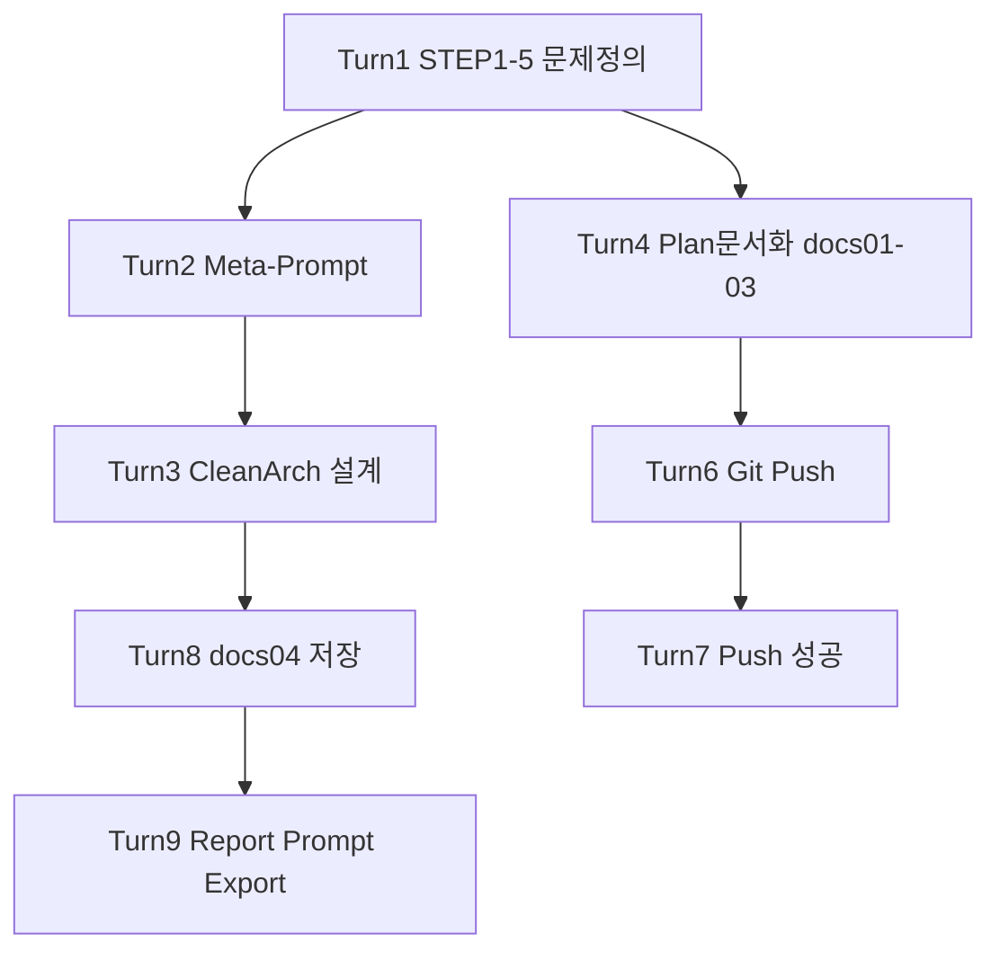

# Magic Square 4×4 — 대화형 프롬프트 Transcript Export

> **Export 일자:** 2026-05-28  
> **세션 ID:** b51c5d5c-06fb-4ea2-85ee-7bce09889aa9  
> **형식:** Turn 기반 대화형 (User → Assistant 요약)  
> **용도:** 동일 워크플로 재현, 프롬프트 체인 학습, Cursor 세션 복기

---

## Turn 1 — 문제 정의 (STEP 1–5)

### User

```
당신은 문제 정의 전문가입니다.
나는 4x4 Magic Square 프로그램을 만들려고 합니다.
하지만 바로 설계하거나 구현하지 마십시오.
먼저 문제 인식 단계부터 진행하십시오.

STEP 1 — Observation (관찰)
- 현재 우리가 해결하려는 상황은 무엇인가?
- 왜 4x4 마방진 문제를 다루는가?
- 어떤 학습·시스템 설계 맥락에서 등장하는가?
  (“마방진을 만든다” 대신 관찰 관점으로 서술)

STEP 2 — Why #1
Q: 왜 마방진을 완성해야 하는가?
A를 가정하여 답하고, 불편함·구조적 문제 분석

STEP 3 — Why #2
Q: 왜 단순 계산이 아니라 프로그램으로 구현하는가?
- 반복 가능성, 검증 자동화, 오류 방지, 규칙 기반 사고 훈련

STEP 4 — Why #3 (핵심 발견)
Q: 왜 TDD 방식으로 설계하려 하는가?
- 통제 대상, 불변 조건, I/O 명확성

STEP 5 — 진짜 문제 정의
1. 표면 문제 정의 (잘못된 정의)
2. 개선된 문제 정의
3. 핵심 Invariant
4. 훈련하려는 사고 능력

제약: 구현 설계 X, 코드 X, 알고리즘 X, Markdown 구조화
```

### Assistant (요약)

- 워크스페이스 빈 상태 확인
- 목적 가정: **생성 + 검증** (TDD 학습·데모)
- STEP 1–5 전체 Markdown 작성 (Plan 모드)
- 다음 단계 제안: STEP 6 Problem Framing 또는 Acceptance Criteria

### 산출물

- Cursor Plan: `4x4_magic_square_문제정의_b2aefcc0.plan.md`

---

## Turn 2 — 실행용 프롬프트 설계 (Meta-Prompt)

### User

```
너는 [프롬프트 설계자]다.
나는 Magic Square 4x4 TDD 설계 문서를 만들기 위한 프롬프트가 필요하다.
지금 설계 문서를 만들지 말고, 나중에 실행할 수 있는 프롬프트만 작성하라.

금지: 구현, 파일 수정, 테스트 코드
출력: 실행용 프롬프트 (12섹션 TDD 설계 문서 생성용)
```

### Assistant (요약)

- **실행용 프롬프트** Markdown 블록 제공 (복사·붙여넣기용)
- 포함: 역할, 금지사항, Invariant, 12섹션 구조, Given/When/Then AC, RED 로드맵, 자기 검수
- 설계 문서 자체는 생성하지 않음

### 산출물

- 채팅 내 실행용 프롬프트 (→ [01-executable-prompts-index.md](01-executable-prompts-index.md) §Prompt-A)

---

## Turn 3 — Dual-Track Clean Architecture 설계

### User

```
당신은 Dual-Track UI + Logic TDD 및 Clean Architecture 설계 전문가입니다.
프로젝트: Magic Square (4x4) — TDD 연습용
목적: 레이어 분리 + 계약 기반 테스트 + 리팩토링 훈련

제약:
- 구현 코드 X (설계/계약/테스트/통합 계획만)
- UI = Boundary, Data = save/load 인터페이스

입력 계약:
- 4x4 int[][] (0=빈칸), 빈칸 2개, 0|1~16, non-zero 중복 금지

출력 계약:
- int[6] = [r1,c1,n1,r2,c2,n2], 1-index
- Case A/B 배치 규칙 (small→first 우선)

출력 형식: §1 Logic ~ §4 Integration (Traceability Matrix 포함)
```

### Assistant (요약)

- 전역 계약, Domain/UI/Data/Integration 4섹션 설계
- 테스트 ID: D-*, U-C*, DL-*, IT-*
- Traceability Matrix, 커버리지 목표, 에러 메시지 8종 고정

### 산출물

- (당시) 채팅 응답 본문
- (이후) [docs/04-dual-track-clean-architecture-design.md](../docs/04-dual-track-clean-architecture-design.md)

---

## Turn 4 — Plan 구현 (문서화)

### User

```
4×4 Magic Square — 문제 정의 (STEP 1–5)
Implement the plan as specified. Do NOT edit the plan file.
To-do's: confirm-purpose, step6-framing, acceptance-criteria
```

### Assistant (요약)

- `docs/01-problem-definition.md` — STEP 1–5 + 목적 **생성+검증** 확정
- `docs/02-problem-framing.md` — STEP 6
- `docs/03-acceptance-criteria.md` — AC-V01~V12, AC-G01~G04
- `README.md` — 문서 인덱스
- To-do 3건 완료

---

## Turn 5 — 상태 확인

### User

```
oo
```

### Assistant (요약)

- Plan 구현 이미 완료 안내
- 다음 옵션: Clean Architecture / TDD Red / 부분 퍼즐 버전

---

## Turn 6 — Git Push

### User

```
git push 해줘
```

### Assistant (요약)

- `docs/` 커밋 `77d3862` 생성
- Push 실패: `waloha2` → `tworimpa/MagicSquare-_1004` 권한 403

---

## Turn 7 — Git Push (Token)

### User

```
[GitHub Personal Access Token 제공] github token 이야 이걸 활용해서 push 해봐
```

### Assistant (요약)

- Token URL로 push **성공** (`main` → origin)
- **보안 경고:** PAT 채팅 노출 → revoke 권고

> **Export 시 토큰 제외:** 보안상 transcript에 PAT 미포함.

---

## Turn 8 — Clean Architecture 설계 (파일 저장)

### User

```
(Turn 3과 동일 Dual-Track 설계 프롬프트 재요청)
```

### Assistant (요약)

- `docs/04-dual-track-clean-architecture-design.md` 파일 생성
- `README.md` — 구현 계약(빈칸 2개 Solve) 반영

---

## Turn 9 — Report & Prompt Export (현재)

### User

```
1. Report 폴더에 보고서 생성해줘
2. 현재까지의 프롬프트 전체를 대화형 프롬프트로 Prompt 폴더에 Export transcript 해줘
```

### Assistant (예정 산출물)

- `Report/00-project-progress-report.md`
- `Prompt/00-dialogue-transcript-export.md` (본 문서)
- `Prompt/01-executable-prompts-index.md`

---

## 대화 흐름 다이어그램



---

## 재현 가이드

| 목표 | 시작 Turn | 참조 |
|---|---|---|
| 문제 정의만 | Turn 1 | docs/01 |
| TDD AC 작성 | Turn 1 → 4 | docs/03 |
| Clean Architecture 설계 | Turn 3 | docs/04 |
| 실행용 Meta-Prompt | Turn 2 | Prompt/01 §A |
| 전체 워크플로 | Turn 1→3→4→8 | Report/00 |

---

**End of Transcript Export**
