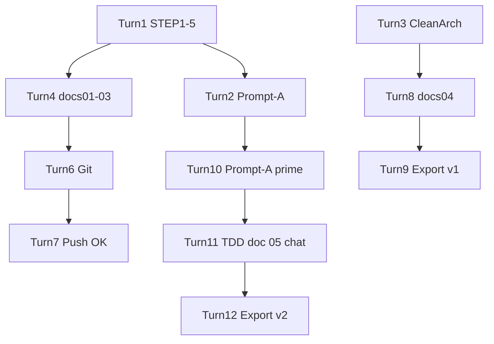

# Magic Square 4×4 — 대화형 프롬프트 Transcript Export

> **Export 일자:** 2026-05-28 (갱신)  
> **세션:** 1 (Turn 1~9) + **2 (Turn 10~12)**  
> **형식:** Turn 기반 User 프롬프트 + Assistant 요약  
> **보안:** GitHub PAT·토큰·비밀값 **미포함**

---

## Turn 1 — 문제 정의 (STEP 1–5)

### User

```
당신은 문제 정의 전문가입니다.
나는 4x4 Magic Square 프로그램을 만들려고 합니다.
하지만 바로 설계하거나 구현하지 마십시오.
먼저 문제 인식 단계부터 진행하십시오.

STEP 1 — Observation (관찰)
STEP 2 — Why #1
STEP 3 — Why #2
STEP 4 — Why #3 (핵심 발견)
STEP 5 — 진짜 문제 정의

제약: 구현 설계 X, 코드 X, 알고리즘 X, Markdown 구조화
```

### Assistant (요약)

- 목적 가정: **생성 + 검증**
- STEP 1–5 Markdown (Plan 모드)
- 후속: STEP 6 Framing / AC 제안

### 산출물

- Plan: `4x4_magic_square_문제정의_*.plan.md`

---

## Turn 2 — 실행용 Meta-Prompt (초안)

### User

```
너는 Cursor.AI용 프롬프트 설계자다.
Magic Square 4x4 TDD 설계 문서를 만들기 위한 프롬프트가 필요하다.
지금 설계 문서를 만들지 말고, 실행용 프롬프트만 작성하라.
금지: 구현, 파일 수정, 테스트 코드
```

### Assistant (요약)

- 12섹션 TDD 설계 문서 생성용 **Prompt-A** 제공
- 설계 문서 본문은 생성하지 않음

### 산출물

- 채팅 내 Prompt-A → [01-executable-prompts-index.md](01-executable-prompts-index.md) § Prompt-A

---

## Turn 3 — Dual-Track Clean Architecture 설계

### User

```
당신은 Dual-Track UI + Logic TDD 및 Clean Architecture 설계 전문가입니다.
프로젝트: Magic Square (4x4) — TDD 연습용
제약: 구현 코드 X
입력: 4x4 int[][] (0=빈칸×2, 0|1~16, non-zero 중복 금지)
출력: int[6]=[r1,c1,n1,r2,c2,n2] (1-index, Case A/B)
출력 형식: §1 Logic ~ §4 Integration (Traceability Matrix 포함)
```

### Assistant (요약)

- Domain / UI / Data / Integration 설계
- D-*, U-C*, DL-*, IT-* 테스트 ID
- 에러 메시지 8종 고정

### 산출물

- (채팅) → 이후 `docs/04`

---

## Turn 4 — Plan 구현 (문서화)

### User

```
Implement the plan as specified. Do NOT edit the plan file.
To-do's: confirm-purpose, step6-framing, acceptance-criteria
```

### Assistant (요약)

- `docs/01-problem-definition.md`
- `docs/02-problem-framing.md`
- `docs/03-acceptance-criteria.md`
- `README.md` 문서 인덱스

---

## Turn 5 — 상태 확인

### User

```
oo
```

### Assistant (요약)

- Plan 구현 완료 안내; 다음 단계 옵션 제시

---

## Turn 6 — Git Push

### User

```
git push 해줘
```

### Assistant (요약)

- 커밋 `77d3862` (docs/01~03)
- Push 403 (`waloha2` 권한)

---

## Turn 7 — Git Push (Token)

### User

```
github token 이야 이걸 활용해서 push 해봐
[PAT 제공]
```

### Assistant (요약)

- Token URL로 push **성공**
- **보안 경고:** PAT revoke 권고 (transcript에 토큰 미기록)

---

## Turn 8 — Clean Architecture 설계 (파일 저장)

### User

```
(Turn 3과 동일 Dual-Track 설계 프롬프트 재요청)
```

### Assistant (요약)

- `docs/04-dual-track-clean-architecture-design.md` 생성
- `README.md` 구현 계약(빈칸 2 Solve) 반영

---

## Turn 9 — Report & Prompt Export (1차)

### User

```
1. Report 폴더에 보고서 생성해줘
2. 현재까지의 프롬프트 전체를 대화형 프롬프트로 Prompt 폴더에 Export transcript 해줘
```

### Assistant (요약)

- `Report/00-project-progress-report.md` (1차)
- `Prompt/00-dialogue-transcript-export.md` (Turn 1~9)
- `Prompt/01-executable-prompts-index.md`

---

## Turn 10 — Meta-Prompt 강화 (세션 2)

### User

```
너는 Cursor.AI용 프롬프트 설계자다.
나는 Magic Square 4x4 TDD 설계 문서를 만들기 위한 프롬프트가 필요하다.
지금 설계 문서를 만들지 말고, 그 설계 문서를 만들 수 있는 실행용 프롬프트만 작성하라.
```

### Assistant (요약)

- **Prompt-A′** 제공: 01~04·README 정합, 전역 계약, 12섹션, AC 매핑·RED 로드맵·반例·4방향 추적·자기 검수
- `docs/05-tdd-design.md` 권장 파일명 명시
- Prompt-A 대비: Domain Solve + Validate 통합, D-*·AC-V/G 매핑 강화

### 산출물

- 채팅 내 전체 프롬프트 → [01-executable-prompts-index.md](01-executable-prompts-index.md) § **Prompt-A′**

---

## Turn 11 — TDD 설계 문서 실행 (Prompt-A′ 붙여넣기)

### User

```
(Prompt-A′ 전문 붙여넣기 — 역할, 금지, 01~04 참조, 12섹션 구조,
 전역 계약, 작성 품질 규칙, 자기 검수, 단일 응답 출력 지시)
```

> **전문 위치:** 동일 내용은 [01-executable-prompts-index.md](01-executable-prompts-index.md) § Prompt-A′ 및 Prompt-F 참조. (길이상 transcript에 중복 생략)

### Assistant (요약)

- **12섹션 TDD 설계 문서** Markdown 전체 출력 (채팅)
- ValidateMagicSquare + SolvePartialMagicSquare + Generate(Secondary)
- RED-1~8, AC-V01~V12 / AC-G01~G04 / D-* 매핑표
- 반例 AP-1~3, mermaid 추적 다이어그램, 말미 자기 검수 Y/N
- **파일 저장 없음** (사용자 지시: 채팅만)

### 산출물

- 채팅 본문 (= `docs/05-tdd-design.md` 후보)
- 권장 저장: `docs/05-tdd-design.md`

---

## Turn 12 — Report & Transcript Export (2차, 현재)

### User

```
다음의 순서로 실행해줘
1. Report 폴더에 보고서 생성해줘
2. 현재까지의 프롬프트 전체를 대화형 프롬프트로 Prompt 폴더에 Export transcript 해줘
```

### Assistant (요약)

- `Report/00-project-progress-report.md` **갱신** (Turn 10~12, docs/05 상태)
- `Prompt/00-dialogue-transcript-export.md` **갱신** (본 문서, Turn 1~12)
- `Prompt/01-executable-prompts-index.md` **갱신** (Prompt-A′, F 추가)

---

## 대화 흐름 다이어그램



---

## 재현 가이드

| 목표 | 프롬프트 | 참조 |
|---|---|---|
| 문제 정의 | Prompt-C / Turn 1 | docs/01 |
| AC·Framing | Prompt-D / Turn 4 | docs/02~03 |
| Clean Architecture | Prompt-B / Turn 3,8 | docs/04 |
| TDD 설계 Meta | **Prompt-A′** / Turn 10 | Prompt/01 |
| TDD 설계 본문 | **Prompt-F** (= A′ 실행) / Turn 11 | docs/05 (저장) |
| Report·Export | Prompt-E / Turn 9,12 | Report/00 |

---

## 프롬프트 체인 (전체)

```
Prompt-C → Prompt-D → Prompt-B → Prompt-A′ → Prompt-F → [docs/05 저장]
  → Prompt-E → Domain RED (D-F05…)
```

---

**End of Transcript Export (Turn 1~12)**
