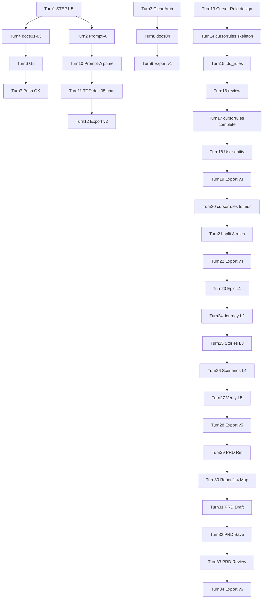

# Magic Square 4×4 — 대화형 프롬프트 Transcript Export

> **Export 일자:** 2026-05-28 (세션 6 갱신)  
> **세션:** 1 (Turn 1~9) + … + 5 (Turn 23~28) + **6 (Turn 29~34)**  
> **형식:** Turn 기반 User 프롬프트 + Assistant 요약  
> **보안:** GitHub PAT·토큰·비밀값 **미포함**

---

## Turn 1 — 문제 정의 (STEP 1–5)

### User

```
당신은 문제 정의 전문가입니다.
나는 4x4 Magic Square 프로그램을 만들려고 합니다.
하지만 바로 설계하거나 구현하지 마십시오.
먼저 문제 인식 단계부터 진행하십시오.

STEP 1 — Observation (관찰)
STEP 2 — Why #1
STEP 3 — Why #2
STEP 4 — Why #3 (핵심 발견)
STEP 5 — 진짜 문제 정의

제약: 구현 설계 X, 코드 X, 알고리즘 X, Markdown 구조화
```

### Assistant (요약)

- 목적 가정: **생성 + 검증**
- STEP 1–5 Markdown (Plan 모드)
- 후속: STEP 6 Framing / AC 제안

### 산출물

- Plan: `4x4_magic_square_문제정의_*.plan.md`

---

## Turn 2 — 실행용 Meta-Prompt (초안)

### User

```
너는 Cursor.AI용 프롬프트 설계자다.
Magic Square 4x4 TDD 설계 문서를 만들기 위한 프롬프트가 필요하다.
지금 설계 문서를 만들지 말고, 실행용 프롬프트만 작성하라.
금지: 구현, 파일 수정, 테스트 코드
```

### Assistant (요약)

- 12섹션 TDD 설계 문서 생성용 **Prompt-A** 제공
- 설계 문서 본문은 생성하지 않음

### 산출물

- 채팅 내 Prompt-A → [01-executable-prompts-index.md](01-executable-prompts-index.md) § Prompt-A

---

## Turn 3 — Dual-Track Clean Architecture 설계

### User

```
당신은 Dual-Track UI + Logic TDD 및 Clean Architecture 설계 전문가입니다.
프로젝트: Magic Square (4x4) — TDD 연습용
제약: 구현 코드 X
입력: 4x4 int[][] (0=빈칸×2, 0|1~16, non-zero 중복 금지)
출력: int[6]=[r1,c1,n1,r2,c2,n2] (1-index, Case A/B)
출력 형식: §1 Logic ~ §4 Integration (Traceability Matrix 포함)
```

### Assistant (요약)

- Domain / UI / Data / Integration 설계
- D-*, U-C*, DL-*, IT-* 테스트 ID
- 에러 메시지 8종 고정

### 산출물

- (채팅) → 이후 `docs/04`

---

## Turn 4 — Plan 구현 (문서화)

### User

```
Implement the plan as specified. Do NOT edit the plan file.
To-do's: confirm-purpose, step6-framing, acceptance-criteria
```

### Assistant (요약)

- `docs/01-problem-definition.md`
- `docs/02-problem-framing.md`
- `docs/03-acceptance-criteria.md`
- `README.md` 문서 인덱스

---

## Turn 5 — 상태 확인

### User

```
oo
```

### Assistant (요약)

- Plan 구현 완료 안내; 다음 단계 옵션 제시

---

## Turn 6 — Git Push

### User

```
git push 해줘
```

### Assistant (요약)

- 커밋 `77d3862` (docs/01~03)
- Push 403 (`waloha2` 권한)

---

## Turn 7 — Git Push (Token)

### User

```
github token 이야 이걸 활용해서 push 해봐
[PAT 제공]
```

### Assistant (요약)

- Token URL로 push **성공**
- **보안 경고:** PAT revoke 권고 (transcript에 토큰 미기록)

---

## Turn 8 — Clean Architecture 설계 (파일 저장)

### User

```
(Turn 3과 동일 Dual-Track 설계 프롬프트 재요청)
```

### Assistant (요약)

- `docs/04-dual-track-clean-architecture-design.md` 생성
- `README.md` 구현 계약(빈칸 2 Solve) 반영

---

## Turn 9 — Report & Prompt Export (1차)

### User

```
1. Report 폴더에 보고서 생성해줘
2. 현재까지의 프롬프트 전체를 대화형 프롬프트로 Prompt 폴더에 Export transcript 해줘
```

### Assistant (요약)

- `Report/00-project-progress-report.md` (1차)
- `Prompt/00-dialogue-transcript-export.md` (Turn 1~9)
- `Prompt/01-executable-prompts-index.md`

---

## Turn 10 — Meta-Prompt 강화 (세션 2)

### User

```
너는 Cursor.AI용 프롬프트 설계자다.
나는 Magic Square 4x4 TDD 설계 문서를 만들기 위한 프롬프트가 필요하다.
지금 설계 문서를 만들지 말고, 그 설계 문서를 만들 수 있는 실행용 프롬프트만 작성하라.
```

### Assistant (요약)

- **Prompt-A′** 제공: 01~04·README 정합, 전역 계약, 12섹션, AC 매핑·RED 로드맵·반例·4방향 추적·자기 검수
- `docs/05-tdd-design.md` 권장 파일명 명시

### 산출물

- 채팅 내 전체 프롬프트 → [01-executable-prompts-index.md](01-executable-prompts-index.md) § **Prompt-A′**

---

## Turn 11 — TDD 설계 문서 실행 (Prompt-A′ 붙여넣기)

### User

```
(Prompt-A′ 전문 붙여넣기 — 역할, 금지, 01~04 참조, 12섹션 구조,
 전역 계약, 작성 품질 규칙, 자기 검수, 단일 응답 출력 지시)
```

> **전문 위치:** [01-executable-prompts-index.md](01-executable-prompts-index.md) § Prompt-A′ · Prompt-F

### Assistant (요약)

- **12섹션 TDD 설계 문서** Markdown 전체 출력 (채팅)
- ValidateMagicSquare + SolvePartialMagicSquare + Generate(Secondary)
- RED-1~8, AC-V01~V12 / AC-G01~G04 / D-* 매핑표
- **파일 저장 없음** (채팅만)

### 산출물

- 채팅 본문 (= `docs/05-tdd-design.md` 후보)

---

## Turn 12 — Report & Transcript Export (2차)

### User

```
다음의 순서로 실행해줘
1. Report 폴더에 보고서 생성해줘
2. 현재까지의 프롬프트 전체를 대화형 프롬프트로 Prompt 폴더에 Export transcript 해줘
```

### Assistant (요약)

- `Report/00-project-progress-report.md` 갱신 (Turn 10~12)
- `Prompt/00-dialogue-transcript-export.md` 갱신 (Turn 1~12)
- `Prompt/01-executable-prompts-index.md` 갱신

---

## Turn 13 — Cursor Rule 설계 (세션 3)

### User

```
MagicSquare Python 프로젝트용 Cursor Rule을 만들고 싶습니다.

조건:
- Python 3.10+
- PEP8
- type hints 필수
- pytest + AAA 패턴
- ECB 아키텍처(boundary/control/entity)
- Dual-Track TDD
- print() 디버깅 금지
- 테스트 약화 금지
- RED 없이 구현 금지

지금 규칙 파일을 바로 만들지 말고,
먼저 Cursor Rule을 어떤 파일 구조와 섹션으로 설계해야 하는지 설명해 주세요.

특히 .cursorrules 방식과 .cursor/rules/*.mdc 방식 중 무엇을 선택해야 하는지,
그리고 MagicSquare 프로젝트에서는 규칙 파일을 어떻게 나누면 좋은지 알려주세요.
```

### Assistant (요약)

- **`.cursor/rules/*.mdc` 권장** (관심사별 분리, globs/alwaysApply)
- 8~9개 `.mdc` 파일 분할안: project, python, pytest, ecb, tdd, forbidden, …
- `docs/` = SSOT, 규칙 = AI 행동 강제
- `.cursorrules`는 레거시·단일 파일 한계 설명

### 산출물

- (채팅) 설계 가이드 — 파일 미생성

---

## Turn 14 — `.cursorrules` YAML 뼈대

### User

```
위 .cursorrules YAML 파일 뼈대를 만들어줘.
아래 최상위 키만 포함하고 값은 비워둬:
project, code_style, architecture, tdd_rules, testing, forbidden, file_structure, ai_behavior
각 키 앞에 80자짜리 # 구분선 주석을 추가해.
YAML 내용만 출력해.
```

### Assistant (요약)

- `.cursorrules` 8개 최상위 키 + 80자 `#` 구분선 뼈대 생성
- 값은 모두 비움

### 산출물

- [`.cursorrules`](../.cursorrules) (뼈대)

---

## Turn 15 — `tdd_rules` 섹션 작성

### User

```
위 .cursorrules 파일의 tdd_rules 섹션을 채워줘.
  - red_phase: 테스트 먼저 작성, 실패 확인 후 다음 단계 진행 조건
  - green_phase: 최소 코드로만 테스트 통과, 이 단계에서 리팩터링 금지
  - refactor_phase: 기능 변경 없이 구조 개선, 커버리지 유지 조건
YAML 형식 유지. tdd_rules 블록만 출력해.
```

### Assistant (요약)

- `tdd_rules` red/green/refactor 3단계 규칙 목록 작성
- RED 확인·최소 구현·리팩터링 금지·커버리지 유지 명시

### 산출물

- `.cursorrules` `tdd_rules` 섹션 갱신

---

## Turn 16 — `.cursorrules` 검토

### User

```
방금 완성한 .cursorrules 파일을 검토해줘.
아래 항목을 확인해:
1. YAML 문법 오류
2. 누락된 필수 섹션
3. tdd_rules와 forbidden 규칙 간의 충돌
4. Cursor AI가 실제로 따를 수 없는 ai_behavior 규칙
문제점만 보고해줘. 수정은 내가 요청할 때만 해.
```

### Assistant (요약)

- YAML 문법: **오류 없음**
- 7개 섹션 내용 누락 (project, code_style, … ai_behavior)
- forbidden 비어 있어 직접 충돌 없음; 테스트 약화 방어 공백
- ai_behavior 비어 있어 검토 대상 없음

### 산출물

- (채팅) 검토 보고 — 수정 없음

---

## Turn 17 — `.cursorrules` 전 섹션 완성

### User

```
위에서 만든 .cursorrules 뼈대의 빈 섹션을 모두 채워줘.
MagicSquare 프로젝트 기준으로 작성해.
(각 섹션 작성 규칙: code_style, architecture ECB 3레이어,
 tdd_rules description/rules/must_not, testing, forbidden pattern/reason/alternative,
 file_structure 트리, ai_behavior before/during/after…)
완성된 .cursorrules 전체 파일을 출력해줘.
```

### Assistant (요약)

- 8개 섹션 전부 MagicSquare 맥락으로 작성
- ECB 의존성, Dual-Track, forbidden 6항, file_structure 트리
- `tdd_rules` red/green/refactor → description · rules · must_not 구조로 재작성
- PyYAML 검증 통과

### 산출물

- [`.cursorrules`](../.cursorrules) (완본)

---

## Turn 18 — User 엔티티 ECB 구현

### User

```
.cursorrules를 읽고
MagicSquare의 User 엔티티 클래스를 ECB 패턴으로 작성해줘.
타입힌트, Google docstring, pytest 테스트 파일도 함께 만들어줘.
```

### Assistant (요약)

- `src/magicsquare/entity/` 패키지 초기화
- `User`, `UserRole`, `DomainValidationError`, `constants`
- `UserRole`: LEARNER / CALLER / REVIEWER (`docs/02` Actors)
- INV-U1~U3, `user_id` 식별자 기반 동등성
- `tests/entity/test_user.py` AAA, U-E01~U-E05
- `pyproject.toml` + **pytest 9 passed GREEN**

### 산출물

| 파일 |
|---|
| `src/magicsquare/entity/user.py` |
| `src/magicsquare/entity/domain_errors.py` |
| `src/magicsquare/entity/constants.py` |
| `tests/entity/test_user.py` |
| `pyproject.toml` |

---

## Turn 19 — Report & Transcript Export (3차)

### User

```
다음의 순서로 실행해줘
1. Report 폴더에 보고서 생성해줘
2. 현재까지의 프롬프트 전체를 대화형 프롬프트로 Prompt 폴더에 Export transcript 해줘
```

### Assistant (요약)

- `Report/00-project-progress-report.md` **갱신** (세션 3, Turn 13~19, User entity, `.cursorrules`)
- `Prompt/00-dialogue-transcript-export.md` **갱신** (Turn 1~19)

---

## Turn 20 — `.cursorrules` → `.cursor/rules` 마이그레이션 (세션 4)

### User

```
@.cursorrules 을 .cursor/rules 로 만들어 줘
rule 은 보기 좋게 넘버링을 해줘
```

### Assistant (요약)

- `.cursorrules` YAML 내용을 `.cursor/rules/magicsquare-project.mdc` 단일 파일로 변환
- 섹션 1~8 계층 넘버링 (Project Overview, Code Style, Architecture, TDD, Testing, Forbidden, File Structure, AI Behavior)
- `alwaysApply: true` 설정
- `.cursorrules`는 삭제하지 않고 유지

### 산출물

- `.cursor/rules/magicsquare-project.mdc` (단일 통합 rule)

---

## Turn 21 — Cursor Rules 섹션 분리

### User

```
섹션을 분리 해서 별도 룰로 만들고 파일에 넘버링을 해줘
```

### Assistant (요약)

- 단일 `magicsquare-project.mdc`를 **8개 `.mdc` 파일**로 분리
- 파일명 넘버링: `01-project-overview` ~ `08-ai-behavior`
- 각 파일 내부 섹션·목록 넘버링 유지
- 파일 간 참조: `04-tdd-rules`, `07-file-structure` 등
- `magicsquare-project.mdc` 삭제

### 산출물

| 파일 |
|---|
| `.cursor/rules/01-project-overview.mdc` |
| `.cursor/rules/02-code-style.mdc` |
| `.cursor/rules/03-architecture-ecb.mdc` |
| `.cursor/rules/04-tdd-rules.mdc` |
| `.cursor/rules/05-testing.mdc` |
| `.cursor/rules/06-forbidden-patterns.mdc` |
| `.cursor/rules/07-file-structure.mdc` |
| `.cursor/rules/08-ai-behavior.mdc` |

---

## Turn 22 — Report & Transcript Export (4차)

### User

```
보고서 내보내주는 것과 프롬프트 저장
```

### Assistant (요약)

- `Report/00-project-progress-report.md` **갱신** (세션 4, Turn 20~22, `.cursor/rules` 마이그레이션)
- `Prompt/00-dialogue-transcript-export.md` **갱신** (Turn 1~22)
- `Prompt/01-executable-prompts-index.md` **갱신** (Prompt-E 출처 Turn 22 반영)

---

## Turn 23 — Level 1: Epic (Business Goal)

### User

```
Epic → User Journey → User Story → Task
Level 1 Epic만: "불변식 기반 사고 훈련 시스템 구축"
구현/테스트/파일 생성 금지
```

### Assistant (요약)

- Epic 11섹션: Business/Learning Goal, Scope, Success Criteria, INV-G/M/S, Traceability Rule
- Level 2 후보 User Story (Track A/B/C/D)

---

## Turn 24 — Level 2: User Journey

### User

```
Level 2 User Journey — Stage 1~5, Persona, Dual-Track
```

### Assistant (요약)

- Persona(지훈), Journey Overview 표, Detailed Stage 1~5
- BlankFinder/MissingNumberFinder/Validator/Solver 책임 분리
- Journey→Story Mapping, Traceability Link

---

## Turn 25 — Level 3: User Stories

### User

```
US-01~05 + Acceptance Criteria (Boundary/Domain 분리)
```

### Assistant (요약)

- US-01 Boundary 입력 검증 (INPUT_* 8 AC)
- US-02~05 Domain: 빈칸, 누락, Validator, Case A/B Solver
- Traceability Matrix

---

## Turn 26 — Level 4: Technical Scenarios

### User

```
SC-DOM-SOL-001, SC-BND-VAL-001~003 (Gherkin)
```

### Assistant (요약)

- Case A fail → B success `[3,3,6,4,4,1]` (D-H03)
- Boundary: empty count, duplicate, value 17 (U-C05/09/08)
- RED/Task Decomposition Preview

---

## Turn 27 — Level 5: Verification and Summary

### User

```
Epic→Journey→Story→Scenario 검증, Edge Case, Invariant Coverage
```

### Assistant (요약)

- 적합성 **7.5/10**, 일부 수정 필요
- Story AC ~35~40% Scenario화; US-02/03 Scenario 缺失
- Missing Items 11건; 조건부 RED 착수 가능

---

## Turn 28 — Report · Transcript Export (5차)

### User

```
Report 폴더에 보고서 생성하고, Prompting 폴더에 Transcript도 Export 해줘
```

### Assistant (요약)

- `Report/01.epic-journey-scenario-verification_Report.md` 생성
- `Prompt/01.epic-journey-scenario-verification_Prompt.md` 생성
- `Report/00`, `Prompt/00` 세션 5 갱신 (Turn 23~28)

---

## Turn 29 — PRD Reference Analysis (1차)

### User

```
Epic→Journey→Story→Scenario 연결 검증 후 PRD 참고 문서 매핑
```

### Assistant (요약)

- Level 5 검토 연장: PRD 섹션 매핑, 7.5/10, Scenario gap

---

## Turn 30 — PRD Reference Analysis (Report 1~4)

### User

```
Report/1~4, Cursor Rules 기준 PRD Reference Document Analysis (8섹션)
```

### Assistant (요약)

- Report/1~4 proxy → docs/01~04
- Source Priority, Appendix vs Body, DN conflicts
- Recommended PRD Outline

---

## Turn 31 — PRD v0.1 작성 (채팅)

### User

```
23섹션 PRD 본문 (Dual-Track, FR-01~05, Traceability)
파일 저장 금지
```

### Assistant (요약)

- PRD v0.1 Draft 전문 (§1~§23)
- SOLVE_IMPOSSIBLE ErrorResponse 확정

---

## Turn 32 — PRD 파일 저장

### User

```
docs/PRD_MagicSquare.md 파일로 저장
```

### Assistant (요약)

- `docs/PRD_MagicSquare.md` 생성 (v0.1, 620 lines)

---

## Turn 33 — PRD 7항목 검토

### User

```
AC, Traceability, Layer, Error, test data, 1-index — 문제·개선안만
```

### Assistant (요약)

- v0.2 P0: TP-N01, DN-04, FR-06, §21 AC gap
- reverse TP-N02 OK; small-first 미정

---

## Turn 34 — Report · Transcript Export (6차, 현재)

### User

```
Report 폴더에 보고서 생성하고, Prompting 폴더에 Transcript도 Export 해줘
```

### Assistant (요약)

- `Report/02.prd-magicsquare-v01_Report.md` 생성
- `Prompt/02.prd-magicsquare-v01_Prompt.md` 생성
- `Report/00`, `Prompt/00` 세션 6 갱신

### 산출물

| 파일 |
|---|
| `Report/02.prd-magicsquare-v01_Report.md` |
| `Prompt/02.prd-magicsquare-v01_Prompt.md` |
| `Report/00-project-progress-report.md` (갱신) |
| `Prompt/00-dialogue-transcript-export.md` (갱신) |

---

## 대화 흐름 다이어그램



---

## 재현 가이드

| 목표 | 프롬프트 | 참조 |
|---|---|---|
| 문제 정의 | Prompt-C / Turn 1 | docs/01 |
| AC·Framing | Prompt-D / Turn 4 | docs/02~03 |
| Clean Architecture | Prompt-B / Turn 3,8 | docs/04 |
| TDD 설계 Meta | Prompt-A′ / Turn 10 | Prompt/01 |
| TDD 설계 본문 | Prompt-F / Turn 11 | docs/05 (저장) |
| Cursor Rule 설계 | Turn 13 | (채팅) |
| `.cursorrules` | Turn 14~17 | `.cursorrules` |
| `.cursor/rules` 마이그레이션 | Turn 20~21 | `.cursor/rules/01~08` |
| User Entity ECB | Turn 18 | src/entity, tests/entity |
| Report·Export | Prompt-E / Turn 9,12,19,22,28,34 | Report/00, Report/01, Report/02 |
| Epic→Scenario L1~L5 | Turn 23~27 | Report/01 |
| PRD v0.1 | Turn 31~33 | docs/PRD_MagicSquare.md, Report/02 |

---

## 프롬프트 체인 (전체)

```
Prompt-C → Prompt-D → Prompt-B → Prompt-A′ → Prompt-F → [docs/05 저장]
  → Cursor Rule 설계 (Turn 13) → .cursorrules (Turn 14~17)
  → User Entity (Turn 18) → Prompt-E
  → .cursor/rules/*.mdc (Turn 20~21) → Epic L1~L5 (Turn 23~27) → PRD v0.1 (Turn 31~32) → PRD Review (Turn 33) → Domain RED (PRD v0.2 후)
```

---

**End of Transcript Export (Turn 1~34)**
