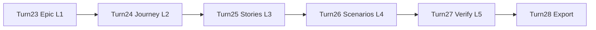

# Epic → Journey → Story → Scenario — 대화 Transcript Export

> **Export 일자:** 2026-05-28  
> **Report ID:** 01  
> **짝 Report:** Report/01.epic-journey-scenario-verification_Report.md  
> **세션:** 5 (Turn 23~28)  
> **형식:** Turn 기반 User 프롬프트 + Assistant 요약  
> **보안:** GitHub PAT·토큰·비밀값 **미포함**

---

## Turn 23 — Level 1: Epic (Business Goal)

### User

```
Magic Square 프로젝트 User Journey 구조: Epic → User Story → Task
지금은 Level 1: Epic만 작성.
구현/테스트/파일 생성 금지. User Story·Task 세분화 금지.
Epic: "불변식 기반 사고 훈련 시스템 구축"
출력: Epic Title, Business Goal, Learning Goal, Problem Statement,
Target Learners, Scope, Non-Scope, Success Criteria, Key Invariants,
Traceability Rule, Candidate User Stories for Level 2
```

### Assistant (요약)

- Level 1 Epic 전체 11섹션 작성 (코드·파일 없음)
- INV-G/M/S 3계층, Dual-Track, ECB, 입출력 계약(`int[4][4]`→`int[6]`)
- 성공 기준: Domain ≥95%, Boundary input 100%, named constant, 하드코딩 금지
- Level 2 후보: Track A Domain (US-D01~07), Track B Boundary (US-B01~05), Control/Data/Quality

### 산출물

- 채팅: Level 1 Epic — Business Goal (미저장 md)

---

## Turn 24 — Level 2: User Journey

### User

```
Level 2: User Journey 작성.
Epic: "불변식 기반 사고 훈련 시스템 구축"
Persona: TDD·Clean Architecture 학습자
Stage 1~5: Problem Recognition → Contract → Domain Separation
  → Dual-Track TDD → Regression Protection
구현/테스트/파일 생성 금지. Task 세분화 금지.
```

### Assistant (요약)

- Persona(지훈), Journey Goal, Overview 표, Stage 1~5 Detailed Journey
- Domain 후보: BlankFinder, MissingNumberFinder, MagicSquareValidator, Solver
- §5 Journey→User Story Mapping, §6 Traceability Link
- Stage 4: UI RED(Mock) vs Logic RED 분리; Stage 5: Edge/Input/Combination/Output 회귀

### 산출물

- 채팅: Level 2 User Journey (미저장 md)

---

## Turn 25 — Level 3: User Stories

### User

```
Level 3: User Stories US-01~US-05 + Acceptance Criteria
Story 1 입력 검증(Boundary), 2 빈칸 좌표, 3 누락 숫자, 4 마방진 검증, 5 두 가지 조합
구현/테스트/파일/Task 세분화 금지. AC는 테스트 가능한 문장.
Boundary/Domain 분리. Contract/Invariant 명시.
```

### Assistant (요약)

- US-01~US-05: Layer, User Story, Given/When/Then AC, Protected Contract/Invariant
- US-01: INPUT_* 6규칙 + Domain 0-call; Error message SSOT 완전 일치
- US-02: row-major, 1-index 외부 노출; US-03: smaller<larger; US-04: INV-M1~M5 AND
- US-05: Case A→B→SOLVE_IMPOSSIBLE; int[6]; 하드코딩 금지
- Traceability Matrix (Epic→Story→Test ID)

### 산출물

- 채팅: Level 3 User Stories (미저장 md)

---

## Turn 26 — Level 4: Implementation Scenarios (Technical)

### User

```
Level 4: Technical Scenarios (Gherkin)
SC-DOM-SOL-001: Case A fail → B success, [3,3,6,4,4,1]
SC-BND-VAL-001~003: 빈칸 1, duplicate, value 17
Decomposition Preview: RED/Task Candidate
구현/테스트/파일 생성 금지.
```

### Assistant (요약)

- Feature + Background, Scenario Catalog 4건
- SC-DOM-SOL-001: 행렬 literal, Case A 행3합=29, Case B full INV-M*, D-H03
- SC-BND-VAL-*: Code·Message·Domain Mock call_count==0; U-C05/08/09
- RED Execution Order, Traceability Matrix, Level 4 DoD
- 수학 검증: Given 격자 missing {1,6}, blanks (3,3)(4,4)

### 산출물

- 채팅: Level 4 Implementation Scenarios (미저장 md)

---

## Turn 27 — Level 5: Scenario Verification and Summary

### User

```
Level 5: Epic→Journey→Story→Scenario 연결 검증
AC 누락, Edge Case, Boundary/Domain 분리, RED/Task 분해, Invariant 추적성
출력: Overall Judgment, Consistency Checks §2~4, Edge Case §5,
Invariant §6, Dual-Track §7, Implementation §8, Traceability §9,
Missing Items §10, Final Summary §11
구현/테스트/파일 생성 금지.
```

### Assistant (요약)

- **적합성 7.5/10**, 상태: 일부 수정 필요
- Epic→Journey→Story: ✅; Story→Scenario: ❌ (AC ~35~40%만 Gherkin화)
- Edge: Case A success·SOLVE_IMPOSSIBLE·null/크기·反例 Scenario 缺失
- Invariant 13항: 완전 4 / 부분 7 / 缺失 2
- §10 Missing 11항 + §11 조건부 진행 가능 (Boundary 3 + D-H03 OK, 보강 병행)

### 산출물

- 채팅: Level 5 Verification and Summary (미저장 md)

---

## Turn 28 — Report · Transcript Export

### User

```
Report 폴더에 보고서 생성하고, Prompting 폴더에 Transcript도 Export 해줘
```

### Assistant (요약)

- `Report/01.epic-journey-scenario-verification_Report.md` 생성
- `Prompt/01.epic-journey-scenario-verification_Prompt.md` 생성 (Prompt/ — Prompting alias)
- `Report/00-project-progress-report.md` 세션 5 갱신
- `Prompt/00-dialogue-transcript-export.md` Turn 23~28 append

### 산출물

- Report/01.*, Prompt/01.*
- Report/00, Prompt/00 갱신

---

## 세션 5 흐름



---

**End of Transcript Export (Turn 23~28)**
