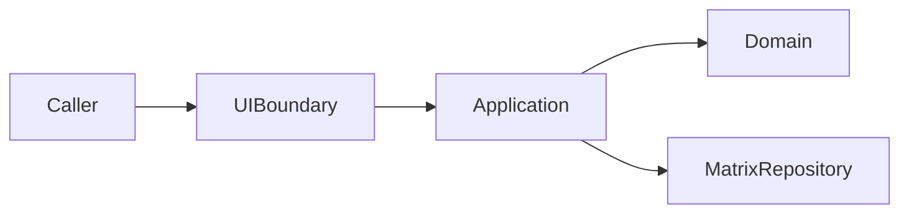

# Magic Square 4×4 — 프로젝트 진행 보고서

| 항목 | 내용 |
|---|---|
| **프로젝트명** | Magic Square 4×4 — TDD 연습 |
| **저장소** | https://github.com/tworimpa/MagicSquare-_1004.git |
| **보고 일자** | 2026-05-28 |
| **현재 단계** | 설계·명세 완료 / **구현·테스트 코드 미착수** |

---

## 1. Executive Summary

4×4 마방진 문제를 **TDD·Clean Architecture·Dual-Track(UI/Logic)** 관점으로 다루는 학습 프로젝트이다.  
알고리즘 난이도보다 **레이어 분리, 계약 기반 테스트, 리팩토링** 훈련이 목적이다.

**현재까지 완료:** 문제 정의(STEP 1–5), Problem Framing(STEP 6), Acceptance Criteria, Dual-Track Clean Architecture 설계 문서, GitHub 원격 push.

**미완료:** Domain/UI/Data 레이어 구현, 단위·통합 테스트 코드, CI 커버리지 설정.

---

## 2. 프로젝트 목표 변천

| 단계 | 목적 | 상태 |
|---|---|---|
| 초기 (STEP 1–5) | **생성 + 검증** — 유효 마방진 생성·자동 판정 | 문서화 완료 (`docs/01~03`) |
| 후기 (Clean Architecture) | **부분 퍼즐 풀이** — 빈칸 2개, `int[6]` 출력 | **구현 계약 확정** (`docs/04`) |

> **주의:** `docs/01~03`은 "완성 격자 Validate/Generate" 관점, `docs/04`는 "빈칸 2개 Solve" 관점이다. **구현 시 `docs/04` 계약을 우선** 적용한다.

---

## 3. 확정된 입·출력 계약 (Implementation Contract)

### 입력

| 규칙 | 값 |
|---|---|
| 형식 | `int[4][4]` |
| 빈칸 | `0`, **정확히 2개** |
| 값 범위 | `0` 또는 `1~16` |
| 중복 | **0 제외** 중복 금지 |
| 빈칸 순서 | row-major `(1,1)→…→(4,4)` 스캔 |

### 출력 (성공)

| 규칙 | 값 |
|---|---|
| 형식 | `int[6]` = `[r1,c1,n1,r2,c2,n2]` |
| 좌표 | **1-index** (1~4) |
| 배치 | Case A: small→첫빈칸, large→둘째빈칸 (마방진이면 채택) |
| | Case B: Case A 실패 시 반대 배치 |
| | Case C: 둘 다 실패 → `SOLVE_IMPOSSIBLE` |

### Magic Constant

- **34** (행·열·주대각·부대각 합)

---

## 4. 산출물 목록

### 4.1 문서 (`docs/`)

| 파일 | 내용 | 완료 |
|---|---|---|
| [01-problem-definition.md](../docs/01-problem-definition.md) | STEP 1–5, Invariant, 목적 확정 | ✓ |
| [02-problem-framing.md](../docs/02-problem-framing.md) | Actors, SC/FS, 성공·실패 시나리오 | ✓ |
| [03-acceptance-criteria.md](../docs/03-acceptance-criteria.md) | Given/When/Then AC 16건, RED 로드맵 | ✓ |
| [04-dual-track-clean-architecture-design.md](../docs/04-dual-track-clean-architecture-design.md) | Domain/UI/Data/Integration 설계 | ✓ |

### 4.2 보고·프롬프트

| 파일 | 내용 |
|---|---|
| [Report/00-project-progress-report.md](00-project-progress-report.md) | 본 보고서 |
| [Prompt/00-dialogue-transcript-export.md](../Prompt/00-dialogue-transcript-export.md) | 대화형 프롬프트 Export |
| [Prompt/01-executable-prompts-index.md](../Prompt/01-executable-prompts-index.md) | 재실행용 프롬프트 모음 |

### 4.3 코드

| 항목 | 상태 |
|---|---|
| Domain 구현 | **없음** |
| UI Boundary 구현 | **없음** |
| Data Repository 구현 | **없음** |
| 테스트 코드 | **없음** |

---

## 5. 아키텍처 요약

| 레이어 | 책임 | 테스트 ID 범위 |
|---|---|---|
| **Domain** | 빈칸·누락 분석, Case A/B, 마방진 판정 | D-H*, D-F*, D-E* |
| **UI Boundary** | 입·출력 계약, 에러 매핑 (Domain Mock) | U-C01~12 |
| **Data** | MatrixRepository save/load | DL-01~07 |
| **Integration** | E2E + 저장 round-trip | IT-OK*, IT-F* |

---

## 6. 테스트 설계 현황

### Domain (RED 우선 순서)

1. D-F05, D-F03, D-F06 — Grid VO  
2. D-F01, D-F02 — EmptyCellPair  
3. D-H04, D-H05 — Analyzer  
4. D-E03, D-E04 — Validator  
5. D-H02, D-H03, D-F04 — Strategy  
6. D-H01, D-E01, D-E02 — Solve E2E  

### 커버리지 목표 (구현 후)

| Layer | 목표 |
|---|---|
| Domain | ≥95% branch |
| UI Boundary | ≥85% branch |
| Data | ≥80% branch |

---

## 7. Git 이력

| 커밋 | 설명 | 원격 |
|---|---|---|
| `3eb5486` | first commit (README) | push 완료 |
| `77d3862` | docs/01~03 추가 | push 완료 |
| (로컬) | docs/04, Report/, Prompt/ | **미 push** |

---

## 8. 리스크·이슈

| ID | 이슈 | 영향 | 조치 |
|---|---|---|---|
| R-01 | docs/01~03 vs docs/04 목적 불일치 | 혼란 | 구현은 docs/04 우선; 01~03은 학습 배경으로 유지 |
| R-02 | GitHub PAT 채팅 노출 | 보안 | **토큰 revoke 권고** (이미 push에 사용됨) |
| R-03 | 구현 코드 없음 | 다음 단계 블로커 | Domain RED부터 TDD 착수 |

---

## 9. 다음 단계 (권장)

| 순서 | 작업 | 산출물 |
|---|---|---|
| 1 | `PartialGrid4x4` Domain RED 테스트 작성 | `src/domain`, `test/domain` |
| 2 | `MagicSquareValidator` RED | D-E03, D-E04 |
| 3 | `CompletionStrategy` RED | D-H02, D-H03 |
| 4 | UI Boundary Mock 테스트 | U-C01~12 |
| 5 | InMemory `MatrixRepository` | DL-01~07 |
| 6 | Integration IT-OK01, IT-F01~03 | E2E |
| 7 | docs/04 + Report + Prompt 커밋·push | Git |

---

## 10. 자기 검수 체크리스트

- [x] 문제 정의 STEP 1–5 문서화
- [x] STEP 6 Problem Framing
- [x] Acceptance Criteria (Given/When/Then)
- [x] Dual-Track Clean Architecture 설계
- [x] 입·출력 계약 고정 (int[4][4] → int[6])
- [x] Traceability Matrix
- [x] 진행 보고서 (본 문서)
- [x] 대화형 프롬프트 Export
- [ ] Domain TDD Red 구현
- [ ] Git push (Report/Prompt/docs/04)

---

**작성:** Cursor AI Agent (Magic Square 4×4 세션)  
**참조:** [README.md](../README.md), [docs/](../docs/)
