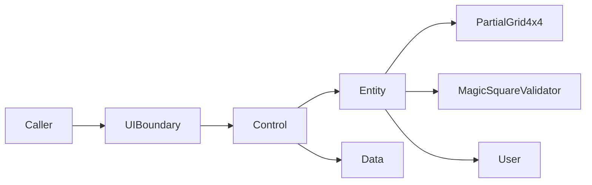

# Magic Square 4×4 — 프로젝트 진행 보고서

| 항목 | 내용 |
|---|---|
| **프로젝트명** | Magic Square 4×4 — TDD 연습 |
| **저장소** | https://github.com/tworimpa/MagicSquare-_1004.git |
| **보고 일자** | 2026-05-28 (세션 6 갱신) |
| **현재 단계** | **`docs/PRD_MagicSquare.md` v0.1 저장** / Epic→Scenario(L1~L5) / **PRD v0.2 보완 대기** / Domain Solve 미착수 |

---

## 1. Executive Summary

4×4 마방진을 **TDD·ECB(Entity-Boundary-Control)·Dual-Track** 로 다루는 학습 프로젝트이다. 알고리즘 난이도보다 **레이어 분리, 계약 기반 테스트, 리팩토링** 훈련이 목적이다.

**세션 6에서 완료 (Turn 29~34)**

- **PRD Reference Document Analysis** (Report/1~4 기준 매핑, Source Priority)
- **`docs/PRD_MagicSquare.md` v0.1** — 23섹션, FR-01~05, Dual-Track, Traceability
- **PRD 7항목 검토** — v0.2 P0 보완 항목 식별 (TP-N01, DN-04, §21 AC gap)
- **Report 02** · **Prompt 02** · `00-*` 갱신 (Turn 29~34)

**세션 5에서 완료 (Turn 23~28)**

- **Level 1 Epic** — 불변식 기반 사고 훈련 시스템 구축 (Business Goal, INV-G/M/S, Success Criteria)
- **Level 2 User Journey** — Stage 1~5 (Problem Recognition → Regression Protection)
- **Level 3 User Stories** — US-01~US-05 (Boundary/Domain 분리, Given/When/Then AC)
- **Level 4 Technical Scenarios** — SC-DOM-SOL-001, SC-BND-VAL-001~003 (Gherkin)
- **Level 5 Verification** — 적합성 7.5/10, Scenario 보강 항목 11건 식별
- **Report 01** · **Prompt 01** · `00-*` 누적 Export (Turn 23~28)

**세션 4에서 완료 (Turn 20~22)**

- `.cursorrules` → `.cursor/rules/magicsquare-project.mdc` 마이그레이션 (넘버링 적용)
- 단일 rule 파일을 **8개 섹션별 `.mdc` 파일**로 분리 (`01`~`08` 파일명 넘버링)
- Report·Prompt Transcript Export (Turn 1~22)

**세션 3에서 완료 (Turn 13~19)**

- Cursor Rule 설계 가이드 (`.cursor/rules/*.mdc` vs `.cursorrules` 비교)
- `.cursorrules` YAML 뼈대 생성 → `tdd_rules` 세분화 → 전 섹션 완성
- `.cursorrules` 검토 (YAML 문법·섹션 누락·규칙 충돌·AI 이행성)
- **ECB entity 레이어** `User` 엔티티 + pytest 9건 **GREEN**
- `pyproject.toml`, `src/magicsquare/` 패키지 구조 초기화

**이전 세션까지 완료**

- 문제 정의 STEP 1–5 (`docs/01`)
- Problem Framing STEP 6 (`docs/02`)
- Acceptance Criteria (`docs/03`)
- Dual-Track Clean Architecture (`docs/04`)
- TDD 설계 문서 본문 — Turn 11 채팅 산출 (12섹션)
- 실행용 Meta-Prompt 강화판 — `Prompt/01` § Prompt-A′

**미완료**

- `docs/05-tdd-design.md` 파일 저장(채팅만 존재 시)
- Domain 핵심 VO/Service (`PartialGrid4x4`, `MagicSquareValidator`, …)
- Boundary / Control / Data 레이어 구현
- CI·커버리지 설정

---

## 2. 프로젝트 목표 변천

| 단계 | 목적 | 상태 |
|---|---|---|
| STEP 1–5 | **생성 + 검증** — 유효 마방진·자동 판정 | `docs/01` ✓ |
| STEP 6 + AC | 성공·실패 시나리오, Given/When/Then | `docs/02~03` ✓ |
| Clean Architecture | **빈칸 2개 Solve** — `int[4][4]` → `int[6]` | `docs/04` ✓ |
| TDD 설계 통합 | 01~04 정합 + RED 로드맵 + AC 매핑 | 채팅 산출 (Turn 11) |
| **Cursor Rules** | AI·개발 규칙 SSOT (TDD·ECB·pytest) | **`.cursor/rules/*.mdc` ✓** |
| **Entity 1차** | ECB entity 패턴·테스트 훈련 | **`User` ✓** |

---

## 3. 확정된 입·출력 계약

| 구분 | 규칙 |
|---|---|
| **입력** | `int[4][4]`; `0`=빈칸 **2개**; 값 ∈ `{0}∪{1..16}`; non-zero 중복 금지 |
| **빈칸 순서** | row-major `(1,1)→…→(4,4)` |
| **출력** | `int[6]` = `[r1,c1,n1,r2,c2,n2]`; **1-index** |
| **배치** | Case A → Case B → `SOLVE_IMPOSSIBLE` |
| **Magic sum** | **34** (행·열·주대각·부대각) |

---

## 4. 산출물 목록

### 4.1 문서 (`docs/`)

| 파일 | 내용 | 상태 |
|---|---|---|
| [01-problem-definition.md](../docs/01-problem-definition.md) | STEP 1–5, INV-1~5 | ✓ 저장 |
| [02-problem-framing.md](../docs/02-problem-framing.md) | SC/FS, Actors | ✓ 저장 |
| [03-acceptance-criteria.md](../docs/03-acceptance-criteria.md) | AC-V01~V12, AC-G01~G04 | ✓ 저장 |
| [04-dual-track-clean-architecture-design.md](../docs/04-dual-track-clean-architecture-design.md) | Domain/UI/Data/IT | ✓ 저장 |
| [PRD_MagicSquare.md](../docs/PRD_MagicSquare.md) | 구현 전 PRD v0.1 | ✓ 저장 |
| `05-tdd-design.md` | 12섹션 TDD 설계 | ⚠ 채팅만 (파일 미저장) |

### 4.2 규칙 · 설정

| 파일 | 내용 | 상태 |
|---|---|---|
| [`.cursorrules`](../.cursorrules) | 레거시 YAML (8섹션 완본) | ✓ 유지 (참조용) |
| `.cursor/rules/01-project-overview.mdc` | 프로젝트 개요·계약·SSOT | ✓ 저장 |
| `.cursor/rules/02-code-style.mdc` | PEP8, type hints, docstring | ✓ 저장 |
| `.cursor/rules/03-architecture-ecb.mdc` | ECB 레이어·의존성·Dual-Track | ✓ 저장 |
| `.cursor/rules/04-tdd-rules.mdc` | RED / GREEN / REFACTOR | ✓ 저장 |
| `.cursor/rules/05-testing.mdc` | pytest, AAA, Test ID | ✓ 저장 |
| `.cursor/rules/06-forbidden-patterns.mdc` | 금지 패턴 6종 | ✓ 저장 |
| `.cursor/rules/07-file-structure.mdc` | src/ · tests/ 트리 | ✓ 저장 |
| `.cursor/rules/08-ai-behavior.mdc` | AI 코딩 전·중·후 규칙 | ✓ 저장 |
| [`pyproject.toml`](../pyproject.toml) | pytest `pythonpath`, Python ≥3.10 | ✓ 저장 |

> **규칙 SSOT:** Cursor IDE는 `.cursor/rules/*.mdc`를 우선 적용. `.cursorrules`는 레거시 참조용.

### 4.3 Report · Prompt

| 파일 | 내용 |
|---|---|
| [00-project-progress-report.md](00-project-progress-report.md) | 본 보고서 |
| [00-dialogue-transcript-export.md](../Prompt/00-dialogue-transcript-export.md) | Turn 1~22 대화형 Export |
| [01-executable-prompts-index.md](../Prompt/01-executable-prompts-index.md) | Prompt-A ~ A′, B~F |

### 4.4 코드 (`src/` · `tests/`)

| 파일 | 레이어 | 상태 |
|---|---|---|
| `src/magicsquare/entity/user.py` | Entity | ✓ |
| `src/magicsquare/entity/domain_errors.py` | Entity | ✓ |
| `src/magicsquare/entity/constants.py` | Entity | ✓ |
| `tests/entity/test_user.py` | Entity 테스트 (9 passed) | ✓ GREEN |
| `PartialGrid4x4`, `MagicSquareValidator`, … | Entity (핵심) | **없음** |
| boundary / control / data | — | **없음** |

---

## 5. Cursor Rules 요약 (`.cursor/rules/`)

| # | 파일 | 핵심 내용 |
|---|---|---|
| 01 | `01-project-overview.mdc` | MagicSquare 계약, docs SSOT, Domain RED 순서 |
| 02 | `02-code-style.mdc` | Python 3.10+, PEP8, type hints, Google docstring, line 88 |
| 03 | `03-architecture-ecb.mdc` | ECB 3레이어, 의존성 방향, Dual-Track |
| 04 | `04-tdd-rules.mdc` | red/green/refactor — description · rules · must_not |
| 05 | `05-testing.mdc` | pytest, AAA, coverage 80%, test_ 접두사 |
| 06 | `06-forbidden-patterns.mdc` | print(), 하드코딩 상수, bare except, 테스트 약화, RED 생략 |
| 07 | `07-file-structure.mdc` | `src/magicsquare/{boundary,control,entity,data}/`, `tests/` |
| 08 | `08-ai-behavior.mdc` | 코딩 전·중·후 규칙, tdd_rules 위반 시 경고 |

모든 rule: `alwaysApply: true`

---

## 6. User 엔티티 구현 요약

| 항목 | 내용 |
|---|---|
| **목적** | ECB entity 패턴·TDD·type hints·Google docstring 훈련 |
| **Actor 매핑** | `UserRole`: LEARNER / CALLER / REVIEWER (`docs/02` §6.1) |
| **불변조건** | INV-U1(user_id), INV-U2(display_name), INV-U3(role) |
| **동등성** | `user_id` 식별자 기반 (엔티티 패턴) |
| **테스트** | U-E01~U-E05, AAA, 9 passed |

> **참고:** `docs/04`는 마방진 VO 중심(Entity 없음)이나, 세션 3에서 ECB entity 연습용 `User`를 선행 구현함.

---

## 7. TDD 설계 요약 (Turn 11, 미변경)

| Capability | RED 우선 | 핵심 AC/D |
|---|---|---|
| **ValidateMagicSquare** | RED-3~7 | AC-V01~V12 |
| **SolvePartialMagicSquare** | RED-1~5 | D-F05, D-H01, … |
| **GenerateMagicSquare** (Secondary) | RED-8 | AC-G01~G04 |

**Domain RED 순서 (권장):**  
`PartialGrid4x4` → `EmptyCellPair`/`Analyzer` → `MagicSquareValidator` → `CompletionStrategy` → `SolvePartialMagicSquare`

---

## 8. 아키텍처 요약

| 레이어 | 테스트 ID | 현재 상태 |
|---|---|---|
| Entity | D-H*, D-F*, D-E*, U-E* | **User만 GREEN** |
| Boundary | U-C01~12 | 미착수 |
| Control | — | 미착수 |
| Data | DL-01~07 | 미착수 |
| Integration | IT-* | 미착수 |

---

## 9. 세션·Git 현황

| 구분 | 내용 |
|---|---|
| **세션 1** | Turn 1~9 — 문제정의, docs/01~04, push, 1차 Report/Export |
| **세션 2** | Turn 10~12 — Meta-Prompt A′, TDD 설계 문서, 2차 Report/Export |
| **세션 3** | Turn 13~19 — Cursor Rules, `.cursorrules`, User entity, 3차 Report/Export |
| **세션 4** | Turn 20~22 — `.cursor/rules/*.mdc` 마이그레이션·분리, 4차 Report/Export |
| **Git** | `.cursor/rules/`, `.cursorrules`, `src/`, `tests/`, `pyproject.toml` **로컬·미 push 가능** |

---

## 10. 리스크·이슈

| ID | 이슈 | 조치 |
|---|---|---|
| R-01 | docs/01~03 vs docs/04 관점 차이 | Domain Solve는 04+05 계약 우선 |
| R-02 | PAT 채팅 노출 (Turn 7) | **토큰 revoke** 권고 |
| R-03 | `05-tdd-design.md` 미파일화 | Turn 11 응답을 `docs/05`로 저장 |
| R-04 | Domain 핵심 VO 미구현 | RED-1 `PartialGrid4x4` (D-F05) 착수 |
| R-05 | User vs docs/04 Entity 없음 서술 | User는 ECB 연습용; 핵심 Domain은 VO 우선 |
| R-06 | `.cursorrules` vs `.cursor/rules` 이중 존재 | `.cursor/rules`를 SSOT로 사용; `.cursorrules`는 정리·삭제 검토 |
| R-07 | L1~L5 명세 채팅만 존재 | `docs/` 또는 Report 저장 검토; Level 4 Scenario 4건만 — **보강 필요** |
| R-08 | PRD v0.1 Draft | v0.2: TP-N01, DN-04, Traceability AC gap — **구현 RED 전 보완 권장** |

---

## 11. 다음 단계 (권장)

| 순서 | 작업 | 산출물 |
|---|---|---|
| 1 | **PRD v0.2** P0 보완 (TP-N01, DN-04, FR-06, §21) | `docs/PRD_MagicSquare.md` |
| 2 | Level 4 Scenario 보강 (Level 5 §10) | SC-DOM-BLK/MIS/SOL-002/003, SC-BND-VAL-004~ |
| 3 | RED 착수: D-H03, U-C05/08/09 (PRD v0.2 후) | tests + minimal src |
| 3 | Turn 11 TDD 설계 → `docs/05-tdd-design.md` 저장 | docs/05 |
| 4 | Domain RED 순서 D-F05 → … → D-H01 | entity + tests |
| 5 | Boundary U-C01~12 (Domain Mock) | boundary |
| 6 | L1~L5 명세 docs 저장 (선택) | docs/06 등 |

---

## 12. 자기 검수 체크리스트

- [x] STEP 1–6 + AC 문서화
- [x] Dual-Track Clean Architecture (`docs/04`)
- [x] TDD 설계 12섹션 (채팅)
- [x] 실행용 프롬프트 A′ + 인덱스
- [x] 대화형 Transcript Turn 1~28
- [x] 진행 보고서 (본 문서)
- [x] Epic→Journey→Story→Scenario L1~L5 (채팅)
- [x] Report 01 / Prompt 01 (세션 5 백업)
- [x] `docs/PRD_MagicSquare.md` v0.1
- [x] Report 02 / Prompt 02 (세션 6 백업)
- [x] `.cursorrules` 전 섹션 완성
- [x] `.cursor/rules/*.mdc` 8파일 분리 (01~08)
- [x] Entity 1차 (`User`) + pytest GREEN
- [ ] `docs/05-tdd-design.md` 파일 저장
- [ ] Domain TDD Red (`PartialGrid4x4`)
- [ ] Git push (최신 산출물)

---

**작성:** Cursor AI Agent (Magic Square 4×4 — 세션 6 갱신)  
**참조:** [README.md](../README.md), [Prompt/00-dialogue-transcript-export.md](../Prompt/00-dialogue-transcript-export.md), [docs/PRD_MagicSquare.md](../docs/PRD_MagicSquare.md), [Report/02.prd-magicsquare-v01_Report.md](02.prd-magicsquare-v01_Report.md)
