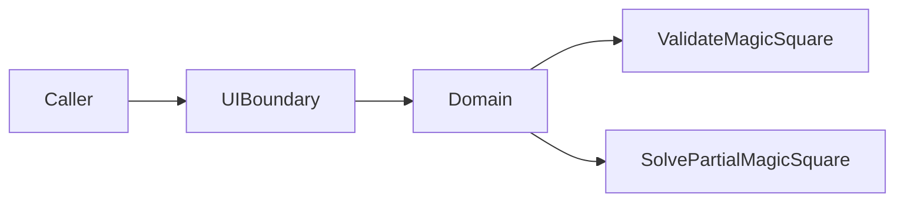

# Magic Square 4×4 — 프로젝트 진행 보고서

| 항목 | 내용 |
|---|---|
| **프로젝트명** | Magic Square 4×4 — TDD 연습 |
| **저장소** | https://github.com/tworimpa/MagicSquare-_1004.git |
| **보고 일자** | 2026-05-28 (갱신) |
| **현재 단계** | 설계·명세 완료 / **TDD 설계 문서(05) 채팅 산출** / 구현·테스트 미착수 |

---

## 1. Executive Summary

4×4 마방진을 **TDD·Clean Architecture·Dual-Track(UI/Logic)** 로 다루는 학습 프로젝트이다. 알고리즘 난이도보다 **레이어 분리, 계약 기반 테스트, 리팩토링** 훈련이 목적이다.

**현재까지 완료**

- 문제 정의 STEP 1–5 (`docs/01`)
- Problem Framing STEP 6 (`docs/02`)
- Acceptance Criteria (`docs/03`)
- Dual-Track Clean Architecture (`docs/04`)
- **TDD 설계 문서 본문** — Turn 11 채팅 산출 (12섹션, 자기 검수 포함)
- **실행용 Meta-Prompt 강화판** — `Prompt/01` § Prompt-A′
- Report·Prompt Transcript Export (본 갱신)

**미완료**

- `docs/05-tdd-design.md` 파일 저장(채팅만 존재 시)
- Domain / UI / Data 구현 및 테스트 코드
- CI·커버리지 설정

---

## 2. 프로젝트 목표 변천

| 단계 | 목적 | 상태 |
|---|---|---|
| STEP 1–5 | **생성 + 검증** — 유효 마방진·자동 판정 | `docs/01` ✓ |
| STEP 6 + AC | 성공·실패 시나리오, Given/When/Then | `docs/02~03` ✓ |
| Clean Architecture | **빈칸 2개 Solve** — `int[4][4]` → `int[6]` | `docs/04` ✓ |
| TDD 설계 통합 | 01~04 정합 + RED 로드맵 + AC 매핑 | **채팅 산출** (Turn 11) |

> **구현 우선순위:** `docs/04` 입·출력 계약 + `05` RED 로드맵( Domain-first ). `docs/01~03`은 Validate/Generate 학습 배경·AC-V/G 참조.

---

## 3. 확정된 입·출력 계약

| 구분 | 규칙 |
|---|---|
| **입력** | `int[4][4]`; `0`=빈칸 **2개**; 값 ∈ `{0}∪{1..16}`; non-zero 중복 금지 |
| **빈칸 순서** | row-major `(1,1)→…→(4,4)` |
| **출력** | `int[6]` = `[r1,c1,n1,r2,c2,n2]`; **1-index** |
| **배치** | Case A → Case B → `SOLVE_IMPOSSIBLE` |
| **Magic sum** | **34** (행·열·주대각·부대각) |

---

## 4. 산출물 목록

### 4.1 문서 (`docs/`)

| 파일 | 내용 | 상태 |
|---|---|---|
| [01-problem-definition.md](../docs/01-problem-definition.md) | STEP 1–5, INV-1~5 | ✓ 저장 |
| [02-problem-framing.md](../docs/02-problem-framing.md) | SC/FS, Actors | ✓ 저장 |
| [03-acceptance-criteria.md](../docs/03-acceptance-criteria.md) | AC-V01~V12, AC-G01~G04 | ✓ 저장 |
| [04-dual-track-clean-architecture-design.md](../docs/04-dual-track-clean-architecture-design.md) | Domain/UI/Data/IT | ✓ 저장 |
| `05-tdd-design.md` | 12섹션 TDD 설계 | ⚠ 채팅만 (파일 미저장) |

### 4.2 Report · Prompt

| 파일 | 내용 |
|---|---|
| [00-project-progress-report.md](00-project-progress-report.md) | 본 보고서 |
| [00-dialogue-transcript-export.md](../Prompt/00-dialogue-transcript-export.md) | Turn 1~12 대화형 Export |
| [01-executable-prompts-index.md](../Prompt/01-executable-prompts-index.md) | Prompt-A ~ A′, B~F |

### 4.3 코드

| 항목 | 상태 |
|---|---|
| Domain / UI / Data | **없음** |
| 테스트 코드 | **없음** |

---

## 5. TDD 설계 요약 (Turn 11)

| Capability | RED 우선 | 핵심 AC/D |
|---|---|---|
| **ValidateMagicSquare** | RED-3~7 | AC-V01~V12 |
| **SolvePartialMagicSquare** | RED-1~5 | D-F05, D-H01, … |
| **GenerateMagicSquare** (Secondary) | RED-8 | AC-G01~G04 |

**Domain RED 순서 (권장):**  
`PartialGrid4x4` → `EmptyCellPair`/`Analyzer` → `MagicSquareValidator` → `CompletionStrategy` → `SolvePartialMagicSquare` → UI/Data는 Domain GREEN 이후.

**반例(anti-pattern):** 행·열만 34 / Case A·B 모두 실패 등 false positive 방지 3건 명시.

---

## 6. 아키텍처 요약

| 레이어 | 테스트 ID | 1차 RED |
|---|---|---|
| Domain | D-H*, D-F*, D-E* | ✓ 우선 |
| UI Boundary | U-C01~12 | Domain Mock 후 |
| Data | DL-01~07 | InMemory 1차 |
| Integration | IT-* | Out of Scope (1차) |

---

## 7. 세션·Git 현황

| 구분 | 내용 |
|---|---|
| **세션 1** | Turn 1~9 — 문제정의, docs/01~04, push, 1차 Report/Export |
| **세션 2** | Turn 10~12 — Meta-Prompt A′, TDD 설계 문서 생성, 본 Report/Export 갱신 |
| **Git** | `main`에 docs/01~03 push 이력; docs/04, Report/, Prompt/, 05 **로컬·미 push 가능** |

---

## 8. 리스크·이슈

| ID | 이슈 | 조치 |
|---|---|---|
| R-01 | docs/01~03 vs docs/04 관점 차이 | 구현·05는 04+Solve 계약 우선 |
| R-02 | PAT 채팅 노출 (Turn 7) | **토큰 revoke** 권고 |
| R-03 | `05-tdd-design.md` 미파일화 | Turn 11 응답을 `docs/05`로 저장 권장 |
| R-04 | 구현 없음 | RED-1 `PartialGrid4x4` 착수 |

---

## 9. 다음 단계 (권장)

| 순서 | 작업 | 산출물 |
|---|---|---|
| 1 | Turn 11 TDD 설계 → `docs/05-tdd-design.md` 저장 | docs/05 |
| 2 | `PartialGrid4x4.of` RED (D-F05) | domain + test |
| 3 | `MagicSquareValidator` RED (D-E03, D-E04) | validator |
| 4 | `CompletionStrategy` / `Solve` RED | D-H01 |
| 5 | UI U-C01~12 (Domain Mock) | boundary |
| 6 | docs/04~05, Report, Prompt 커밋·push | Git |

---

## 10. 자기 검수 체크리스트

- [x] STEP 1–6 + AC 문서화
- [x] Dual-Track Clean Architecture (`docs/04`)
- [x] TDD 설계 12섹션 (채팅)
- [x] 실행용 프롬프트 A′ + 인덱스
- [x] 대화형 Transcript Turn 1~12
- [x] 진행 보고서 (본 문서)
- [ ] `docs/05-tdd-design.md` 파일 저장
- [ ] Domain TDD Red 구현
- [ ] Git push (최신 산출물)

---

**작성:** Cursor AI Agent (Magic Square 4×4 — 세션 2 갱신)  
**참조:** [README.md](../README.md), [Prompt/00-dialogue-transcript-export.md](../Prompt/00-dialogue-transcript-export.md)
