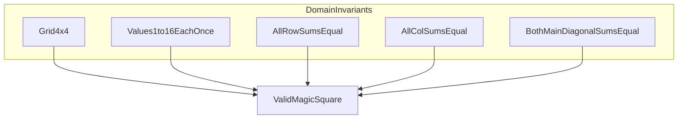

# 4×4 Magic Square — 문제 정의 (STEP 1–5)

## 목적 확정 (Purpose Decision)

| 항목 | 결정 |
|---|---|
| **선택한 목적** | **생성 + 검증** |
| **Primary capability** | 규칙 충족 여부의 **자동 판정** |
| **Secondary capability** | 유효한 4×4 배치 **생성·제시** |
| **Non-goal** | 사용자 퍼즐 UI, 최적화, "가장 예쁜" 배치 탐색 |

**선택 근거**

- TDD·데모·학습 맥락에 가장 적합하다.
- "무엇이 올바른가"(검증)를 먼저 고정한 뒤 "올바른 예시를 제시"(생성)로 확장하는 순서가 Red → Green 학습 흐름과 일치한다.
- 사용자 퍼즐 UI는 UX·상태 관리 등 별도 관심사가 커져 레이어 분리 훈련 목표가 희석된다.
- 검증 전용만으로는 "예시 생성" 시나리오가 빠져 데모·회귀 테스트 소재가 부족하다.

---

## STEP 1 — Observation (관찰)

### 1. 현재 우리가 해결하려는 상황은 무엇인가?

1부터 16까지의 숫자를 **중복 없이** 4×4 격자에 배치해야 하는데, **여러 줄·열·대각선 방향의 합이 모두 같아야** 한다는 조건이 동시에 걸린다. 사람이 손으로 배치하면 "한 줄은 맞는데 다른 줄이 틀렸다"는 상태가 자주 생기고, **전체가 규칙을 동시에 만족하는지 확인하는 일**이 반복적이고 지루하다.

우리가 다루는 상황은 **"제한된 크기의 격자에 숫자를 배치할 때, 여러 방향의 합이라는 교차 제약을 한꺼번에 만족시키고, 그 만족 여부를 신뢰할 수 있게 확인하는 일"**이다.

### 2. 왜 4×4 마방진 문제를 다루는가?

- **규모가 적당하다:** 2×2는 성립하지 않거나 의미가 빈약하고, 그보다 큰 크기는 규칙 조합과 예외가 급격히 늘어난다. 4×4는 "여러 제약이 동시에 작동한다"는 것을 **한눈에·한 세션 안에** 경험하기 좋다.
- **고전적 교육 사례다:** 대칭, 패턴, 불변 합 등 **규칙 기반 사고**를 가르치기 위해 오래 쓰여 왔다.
- **검증 단위가 명확하다:** 행·열·대각선 등 **독립적으로 말할 수 있는 검사 항목**이 있어, "맞다/틀리다"를 쪼개서 다루기 쉽다.

### 3. 어떤 학습·시스템 설계 맥락에서 등장하는가?

- **테스트 주도 사고(TDD):** "올바른 결과"를 먼저 문장·예시로 고정하고, 그에 맞춰 행동을 쌓는 연습.
- **불변 조건(Invariant) 설계:** 겉모습(어떤 칸에 어떤 숫자)보다 **항상 지켜져야 할 조건**을 먼저 정의하는 연습.
- **경계 명확화:** 무엇을 입력으로 받고, 무엇을 "성공"으로 볼지 **계약(contract)** 을 세우는 연습.
- **자동화 가능한 판정:** 사람의 눈과 계산 대신, **동일 규칙을 반복 적용하는 절차**를 시스템에 맡기는 맥락.

**관찰 관점 한 줄 요약:**  
"16개의 서로 다른 값을 4×4에 놓을 때, 여러 방향의 합이라는 교차 규칙을 동시에 만족하는 배치를 **만들고·확인하는 과정**에서, 수작업의 한계와 판정 기준의 모호함이 드러난다."

---

## STEP 2 — Why #1

### Q: 왜 마방진을 완성해야 하는가?

**가정한 답 (A):**  
학습·데모 목적으로 **"규칙이 동시에 성립하는 배치"의 예시**가 필요하고, 그 예시가 **틀리지 않았음을 스스로 증명할 수 있어야** 한다. 즉, "보기 좋은 배치"가 아니라 **검증 가능한 배치**가 필요하다.

### A에서 드러나는 불편함·구조적 문제

| 불편/구조적 문제 | 설명 |
|---|---|
| **부분 성공 착시** | 일부 행·열만 맞아도 "거의 완성"처럼 느껴지나, 전체 규칙은 실패할 수 있다. |
| **검증 부담** | 행 4 + 열 4 + 대각 2 등 **다수의 독립 검사**를 매번 사람이 하면 누락·계산 실수가 난다. |
| **기준 불일치** | "마방진"을 **어디까지** 만족해야 하는지(대각선만? 모든 2×2 부분합?) 팀·개인마다 다르면 "완성"의 의미가 흔들린다. |
| **재현성 부재** | 같은 규칙으로 **다시 만들고·다시 확인**하기 어렵다. 수업·데모·회고마다 결과가 달라질 수 있다. |
| **학습 목표 희석** | 배치 자체에만 몰두하면 **"무엇이 올바른지 정의하는 능력"** 은 훈련되지 않는다. |

**핵심:** 완성해야 하는 이유는 "퍼즐을 푼다"기보다, **교차 제약을 만족하는 상태를 신뢰할 수 있는 기준으로 고정**하기 위함이다.

---

## STEP 3 — Why #2

### Q: 왜 단순 계산이 아니라 프로그램으로 구현하는가?

#### 반복 가능성

- 동일한 규칙을 **언제·누가 실행해도 같은 판정**을 내릴 수 있다.
- 새 배치를 만들거나, 기존 배치를 다시 검사할 때 **절차를 매번 처음부터 설명할 필요**가 없다.

#### 검증 자동화

- 행·열·대각 등 **다수의 검사 항목**을 한 번에, 빠짐없이 적용한다.
- "한 줄만 대표로 확인했다"는 **샘플링 오류**를 줄인다.

#### 오류 방지

- 사람의 산술 실수, 피로, 주의 분산으로 인한 **false positive/negative**를 줄인다.
- **16개 숫자 사용·중복 없음** 같은 기본 조건도 함께 놓치지 않게 한다.

#### 규칙 기반 사고 훈련

- "그리드 전체가 맞다"는 말을 **검사 가능한 하위 규칙들의 논리적 결합**으로 분해하는 연습이 된다.
- 나중에 규모·규칙이 바뀌어도 **"불변 조건 + 경계 + 판정"** 이라는 사고 틀을 재사용할 수 있다.

**한 줄 요약:** 프로그램은 계산기를 대체하는 것이 아니라, **규칙의 일관된 적용·판정·재현**을 담당하는 매개체다.

---

## STEP 4 — Why #3 (핵심 발견)

### Q: 왜 이 문제를 TDD 방식으로 설계하려 하는가?

#### 무엇이 통제되어야 하는가?

- **입력의 범위:** 어떤 값들이 들어올 수 있는지, 격자 크기는 고정인지.
- **성공·실패의 정의:** 어떤 조건 집합을 만족하면 "유효", 하나라도 어기면 "무효"인지.
- **출력의 의미:** "배치 결과"만인지, "검증 결과(통과/실패 + 어디가 어긋났는지)"까지 포함하는지.
- **부수 효과 없음:** 같은 입력에 대해 **항상 같은 판정**이 나와야 한다.

#### 어떤 불변 조건이 존재하는가?

- 격자는 **4×4**이다.
- 사용되는 값은 **1부터 16까지 각각 정확히 한 번**이다(중복·누락 없음).
- **모든 행**의 합이 동일하다.
- **모든 열**의 합이 동일하다.
- **두 주 대각선**의 합도 그와 같다.
- 위 조건들이 **동시에** 성립해야 "유효한 4×4 마방진"이다.

#### 왜 입력/출력이 명확해야 하는가?

- TDD는 **"이 입력이면 이 판정/이 결과"** 를 테스트로 고정한다. 경계가 흐리면 테스트 자체가 논쟁이 된다.
- **실패 케이스**를 설계하려면(한 행만 틀림, 중복 숫자, 범위 밖 값 등) 입력·출력 계약이 선행되어야 한다.
- 학습 목표가 "코드 작성"이 아니라 **문제를 명세로 바꾸는 능력**이므로, I/O가 곧 **문제 정의의 외연**이 된다.

**TDD를 쓰는 진짜 이유:** 마방진은 **겉보기 배치**보다 **불변 조건의 합**이 본질이므로, 테스트는 "기능 목록"이 아니라 **도메인 진리의 문장화** 역할을 한다.

---

## STEP 5 — 진짜 문제 정의

### 1. 표면 문제 정의 (잘못된 정의)

> "4×4 마방진을 **만드는 프로그램**을 작성한다."

**왜 잘못되었나**

- "만든다"만 있고 **무엇이 유효한지**가 빠져 있다.
- **검증·실패·경계**가 없어 성공 기준이 사람마다 달라진다.
- **학습 목표(TDD, 불변 조건, 명세)** 와 연결되지 않는다.
- 입력이 무엇인지(빈 격자? 임의 배치? 생성만?) 불명확하다.

### 2. 개선된 문제 정의 (정확한 정의)

> **4×4 격자에 1~16을 중복 없이 배치한 결과가, 행·열·(범위에 포함된) 대각선의 합 불변 조건을 모두 만족하는지를 자동으로 판정하고, 그 조건을 만족하는 배치를 일관되게 제시할 수 있는 시스템을, 테스트 가능한 명세(입력·출력·성공/실패)로 먼저 고정한 뒤 구현한다.**

### 3. 이 문제의 핵심 Invariant

| ID | Invariant | 검증 가능 조건 |
|---|---|---|
| INV-1 | 구조 | 격자는 4×4 |
| INV-2 | 숫자 집합 | {1,…,16}의 순열(각 값 정확히 1회) |
| INV-3 | 행 합 | 4개 행의 합이 서로 같음 |
| INV-4 | 열 합 | 4개 열의 합이 서로 같음 |
| INV-5 | 대각 합 | 두 주 대각선의 합이 행·열과 같은 값 |

**파생 불변:** 위가 성립하면 magic sum은 **하나의 값**으로 고정된다(4×4에서는 34). 정의의 중심은 "모든 줄이 같다"는 **상대적 동일성**이다.

### 4. 우리가 실제로 훈련하려는 사고 능력

| 사고 능력 | 이 문제에서의 표현 |
|---|---|
| **명세 우선** | "만든다"가 아니라 "무엇이 유효한가"를 먼저 문장·예시로 고정 |
| **불변 조건 분해** | 전체 정합성을 행/열/대각/숫자집합 등 **검증 가능한 단위**로 나눔 |
| **경계 설정** | 입력 범위, 실패 유형, 출력 의미를 **계약**으로 못 박음 |
| **反例 설계** | 거의 맞지만 틀린 배치를 상상해 **테스트가 거짓 안심을 못 하게** 함 |
| **자동화 가능한 판정** | 사람의 "대충 맞는 것 같다"를 **재현 가능한 절차**로 대체 |
| **도메인 vs 구현 분리** | "마방진이란 무엇인가"(도메인)와 "어떻게 만들 것인가"(나중 단계)를 분리 |
