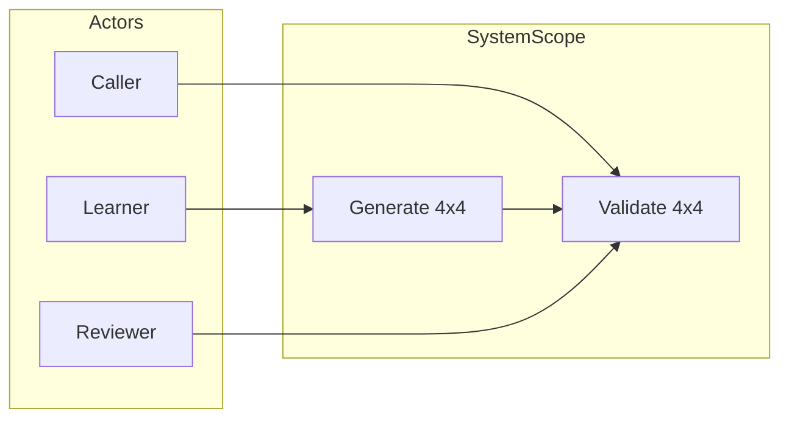

# STEP 6 — Problem Framing

> 전제: [01-problem-definition.md](01-problem-definition.md)의 **생성 + 검증** 목적 및 STEP 1–5 불변 조건을 따른다.

---

## 6.1 사용자 (Actors)

| Actor | 역할 | 기대 |
|---|---|---|
| **학습자 (Learner)** | TDD·Clean Architecture 연습을 수행하는 개발자 | 명확한 계약으로 Red → Green → Refactor 사이클을 반복할 수 있어야 한다 |
| **호출자 (Caller / Boundary Client)** | 완성된 4×4 격자를 제출하거나, 유효한 마방진 생성을 요청하는 외부 주체 | 동일 입력에 대해 **결정적(deterministic)** 인 판정·결과를 받아야 한다 |
| **데모·검증자 (Reviewer)** | 수업·코드 리뷰·회귀 확인 | "왜 이 배치가 마방진인가"를 **자동 검증 결과**로 증명할 수 있어야 한다 |

**Primary user story (검증):**  
검증자는 완성된 4×4 배치를 제출하고, 시스템이 행·열·대각·숫자 집합 규칙을 **통과/실패**로 판정하기를 원한다.

**Secondary user story (생성):**  
학습자·데모 진행자는 **유효한 4×4 마방진 예시**를 요청하고, 반환된 배치가 자동 검증을 **통과**하기를 원한다.

---

## 6.2 시스템 경계 (Scope Boundary)

### In Scope

| 항목 | 설명 |
|---|---|
| **Validate** | 주어진 4×4 완성 격자(값 1~16, 중복 없음)의 마방진 여부 판정 |
| **Generate** | 유효한 4×4 마방진 1개 이상을 **일관된 규칙**으로 제시 |
| **구조 검증** | 입력 크기(4×4), 값 범위(1~16), 중복·누락 검사 |
| **실패 보고** | 무효 입력 또는 생성 불가 시 **명시적 실패** 반환 |

### Out of Scope

| 항목 | 이유 |
|---|---|
| 사용자 퍼즐 UI (칸 채우기, 힌트) | Non-goal; UX·상태 관리가 학습 초점을 벗어남 |
| n×n 일반화 | 4×4 고정으로 invariant 훈련 범위 제한 |
| "최적·최소·최대" 배치 탐색 | 최적화 문제; 규칙 충족만 목표 |
| 부분 완성(빈칸) 퍼즐 풀이 | 별도 입·출력 계약 필요; 본 framing 범위 외 |
| DB·영속 UI | Data Layer는 저장/로드 인터페이스 수준만 (후속 설계) |

---

## 6.3 입·출력 계약 (Framing Level)

### Validate Use Case

| | 규칙 |
|---|---|
| **Input** | 4×4 정수 격자; 각 셀 ∈ {1,…,16}; 16개 값 **순열** |
| **Output (success)** | `valid: true`; (선택) `magicSum: 34` |
| **Output (failure)** | `valid: false`; (선택) `violations: [규칙 ID 목록]` |

### Generate Use Case

| | 규칙 |
|---|---|
| **Input** | 없음 또는 `seed`(결정적 생성 시); 범위는 후속 설계에서 고정 |
| **Output (success)** | 4×4 격자; **Validate를 통과**해야 함 |
| **Output (failure)** | 생성 불가 시 `GENERATION_FAILED` (본 4×4 도메인에서는 발생하지 않을 수 있으나 계약은 유지) |

**Cross-cutting:** 동일 Validate 입력 → **항상 동일** `valid` 결과 (부수 효과 없음).

---

## 6.4 성공 기준 (Success Criteria)

| ID | 기준 | 측정 방법 |
|---|---|---|
| **SC-01** | 알려진 유효 4×4 예시 1개 이상에 대해 Validate → `valid: true` | Acceptance Criteria AC-V01 |
| **SC-02** | INV-1~5를 **각각** 깨는 반例 1개 이상씩 → Validate → `valid: false` | AC-V02~AC-V07 |
| **SC-03** | Generate 결과는 **매 호출** Validate 통과 | AC-G01 |
| **SC-04** | Generate (seed 고정 시) **동일 seed → 동일 격자** | AC-G02 |
| **SC-05** | 잘못된 입력(크기·범위·중복)은 Domain 호출 전 또는 Domain에서 **명시적 거부** | AC-V08~AC-V11 |
| **SC-06** | 모든 성공·실패 기준이 **Given/When/Then** 테스트로 표현 가능 | [03-acceptance-criteria.md](03-acceptance-criteria.md) |

---

## 6.5 실패 시나리오 (Failure Scenarios)

### A. 입력 구조 오류 (Structural)

| ID | 시나리오 | 기대 결과 |
|---|---|---|
| **FS-A01** | 행 개수 ≠ 4 | 거부; `INVALID_GRID_SIZE` |
| **FS-A02** | 열 개수 ≠ 4 | 거부; `INVALID_GRID_SIZE` |
| **FS-A03** | null 또는 빈 입력 | 거부; `INPUT_NULL` |

### B. 값·집합 오류 (Value / Set)

| ID | 시나리오 | 기대 결과 |
|---|---|---|
| **FS-B01** | 값 0 또는 17 이상 포함 | 거부; `INVALID_VALUE_RANGE` |
| **FS-B02** | 1~16 중복 (예: 두 칸에 5) | 거부; `INVALID_DUPLICATE` |
| **FS-B03** | 1~16 중 누락 (15개만 사용) | 거부; `INVALID_MISSING_VALUE` |
| **FS-B04** | 범위 밖 값 + 중복 동시 | **첫 번째 검사 실패** 규칙에 따름 (우선순위: 크기 → 범위 → 중복 → 누락) |

### C. 마방진 규칙 위반 (Rule — Validate)

| ID | 시나리오 | 기대 결과 |
|---|---|---|
| **FS-C01** | 숫자 집합은 valid, **한 행** 합만 다름 | `valid: false`; violation 행 합 |
| **FS-C02** | **한 열** 합만 다름 | `valid: false`; violation 열 합 |
| **FS-C03** | **주대각** 합만 다름 | `valid: false`; violation 대각 |
| **FS-C04** | **부대각** 합만 다름 | `valid: false`; violation 대각 |
| **FS-C05** | 행·열은 34, 대각만 틀림 (**부분 성공 착시**) | `valid: false` — 전체 규칙 동시 만족 필수 |

### D. 생성·통합 (Generate / Integration)

| ID | 시나리오 | 기대 결과 |
|---|---|---|
| **FS-D01** | Generate 직후 Validate 실패 | **시스템 버그**; Generate AC 실패 |
| **FS-D02** | (선택) seed 미지원 구현에 seed 전달 | `UNSUPPORTED_PARAMETER` 또는 무시 정책 **문서화 필수** |

---

## 6.6 실패 우선순위 (검증 순서)

입력 검증은 아래 순서로 **첫 실패에서 중단**:

1. null / 크기 (FS-A*)
2. 값 범위 (FS-B01)
3. 중복 (FS-B02)
4. 누락·개수 (FS-B03)
5. 마방진 규칙 (FS-C*) — 완성 격자만 해당

---

## 6.7 Problem Framing 요약

**한 줄 framing:**  
"학습자와 검증자는 **4×4 마방진의 유효성을 자동·재현 가능하게 판정**하고, **검증 가능한 예시를 생성**할 수 있어야 하며, 모든 실패는 **명시적·테스트 가능한** 계약으로 표현되어야 한다."

---

## 6.8 다음 문서 연결

| 문서 | 내용 |
|---|---|
| [03-acceptance-criteria.md](03-acceptance-criteria.md) | SC-01~06 및 FS-* 를 Given/When/Then AC로 구체화 |
| (후속) Dual-Track / Clean Architecture 설계 | UI Boundary · Domain · Data 레이어 분리 |
