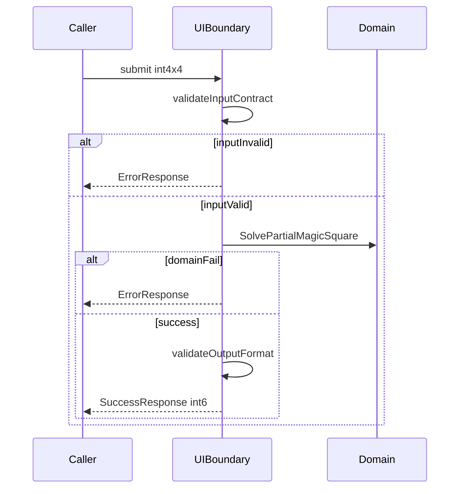
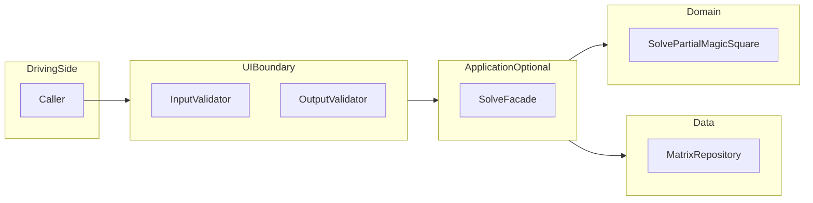

# Dual-Track UI + Logic TDD / Clean Architecture 설계

**프로젝트:** Magic Square (4×4) — TDD 연습용  
**목적:** 알고리즘 난이도보다 **레이어 분리 + 계약 기반 테스트 + 리팩토링** 훈련  
**구현 코드:** 없음 (설계·계약·테스트·통합 계획만)

---

## 전역 계약 (고정)

| 항목 | 규칙 |
|---|---|
| **입력** | `int[4][4]`; `0` = 빈칸; 빈칸 **정확히 2개**; 값 ∈ `{0}∪{1..16}`; **0 제외 중복 금지** |
| **출력 (성공)** | `int[6]` = `[r1,c1,n1,r2,c2,n2]`; 좌표 **1-index** (1~4) |
| **빈칸 순서** | **행 우선(row-major):** `(1,1)→(1,4)→(2,1)→…→(4,4)` 스캔 시 첫 `0` = **첫빈칸**, 둘째 `0` = **둘째빈칸** |
| **누락 숫자** | `{1..16} \ {non-zero in grid}` → 2개; `smaller < larger` |
| **배치 규칙** | **Case A:** 첫빈칸←smaller, 둘째빈칸←larger → 마방진이면 `[r1,c1,smaller,r2,c2,larger]` |
| | **Case B:** Case A 실패 시 첫빈칸←larger, 둘째빈칸←smaller → 마방진이면 `[r1,c1,larger,r2,c2,smaller]` |
| | **Case C:** A·B 모두 실패 → `SOLVE_IMPOSSIBLE` |
| **Magic Constant** | `34` (파생; 정의 중심은 **모든 행·열·주대각·부대각 합 동일**) |

---

# 1) Logic Layer (Domain Layer) 설계

## 1.1 도메인 개념

| 개념 | 유형 | 책임 (SRP) |
|---|---|---|
| **PartialGrid4x4** | Value Object | 4×4 부분 채워진 격자 보유; INV-G1~G4 구조 검증 |
| **CellValue** | Value Object | 단일 값 `0` 또는 `1~16` 유효성 판단 |
| **Position** | Value Object | `(row,col)` 1-index; 범위 1~4; 동등성 |
| **EmptyCellPair** | Value Object | row-major 순 **첫·둘째 빈칸** 좌표; 불변 |
| **MissingPair** | Value Object | 누락 숫자 2개; `smaller()`, `larger()` 제공 |
| **CompletedGrid4x4** | Value Object | 빈칸 없는 4×4; 값 1~16 순열 |
| **Solution6** | Value Object | `[r1,c1,n1,r2,c2,n2]`; INV-S1~S3 검증 |
| **PartialGridAnalyzer** | Domain Service | 빈칸 2개 추출 + 누락 숫자 계산 |
| **MagicSquareValidator** | Domain Service | 완성 격자 INV-M1~M5 판정 |
| **CompletionStrategy** | Domain Service | Case A/B 배치 시도 및 Solution6 선택 |
| **SolvePartialMagicSquare** | Domain Service (Use Case) | Analyzer → Strategy → Validator 오케스트레이션 |

**Entity:** 없음 (식별자 없는 퍼즐 상태만 다룸)

---

## 1.2 도메인 불변조건 (Invariants)

### 입력 격자 (Partial)

| ID | Invariant | 검증 조건 |
|---|---|---|
| **INV-G1** | 4×4 | `rows==4 && each row cols==4` |
| **INV-G2** | 값 범위 | each cell ∈ `{0}∪{1..16}` |
| **INV-G3** | 빈칸 2개 | `count(0)==2` |
| **INV-G4** | non-zero 중복 없음 | `\|nonZeroSet\|==count(nonZero)` |

### 완성 마방진 (Completed)

| ID | Invariant | 검증 조건 |
|---|---|---|
| **INV-M1** | 값 순열 | `{1..16}` 각 1회 |
| **INV-M2** | 행 합 | 4행 각각 `sum==34` |
| **INV-M3** | 열 합 | 4열 각각 `sum==34` |
| **INV-M4** | 주대각 합 | `(1,1)..(4,4)` `sum==34` |
| **INV-M5** | 부대각 합 | `(1,4)..(4,1)` `sum==34` |

### 솔루션 (Solution)

| ID | Invariant | 검증 조건 |
|---|---|---|
| **INV-S1** | 좌표 고정 | `(r1,c1),(r2,c2)` = 입력 빈칸과 동일 |
| **INV-S2** | 숫자 집합 | `{n1,n2}` = MissingPair |
| **INV-S3** | 배치 규칙 | Case A 성공 시 smaller→first; else Case B |

---

## 1.3 핵심 유스케이스 (도메인 관점)

| UC | 설명 | Pre | Post / Fail |
|---|---|---|---|
| **UC-01 FindEmptyCells** | row-major로 빈칸 2개 확정 | INV-G3 | `EmptyCellPair` |
| **UC-02 FindMissingNumbers** | `{1..16}\present` | INV-G4 | `MissingPair` (2개) |
| **UC-03 ValidateMagicSquare** | 완성 격자 마방진 판정 | all 1~16 | `boolean` |
| **UC-04 TryCombinationA** | smaller→first, larger→second | UC-01,02 | valid or false |
| **UC-05 TryCombinationB** | larger→first, smaller→second | UC-01,02 | valid or false |
| **UC-06 Solve** | A 우선, B fallback | INV-G* | `Solution6` or `SOLVE_IMPOSSIBLE` |

---

## 1.4 Domain API (내부 계약)

> 코드 아님. 시그니처 수준 + I/O + 실패.

### `PartialGrid4x4.of(int[][] raw) → PartialGrid4x4 | DomainValidationError`

| | |
|---|---|
| **입력** | 4×4 int 배열 |
| **출력** | VO 또는 `DomainValidationError` |
| **실패** | INV-G1~G4 위반 (`INVALID_GRID_SIZE`, `INVALID_VALUE_RANGE`, `INVALID_EMPTY_COUNT`, `INVALID_DUPLICATE`) |

### `EmptyCellPair.from(PartialGrid4x4 grid) → EmptyCellPair | INVALID_EMPTY_COUNT`

| | |
|---|---|
| **Pre** | INV-G3 |
| **Post** | first = row-major 첫 `0`; second = 둘째 `0` |
| **출력 필드** | `firstRow`, `firstCol`, `secondRow`, `secondCol` (1-index) |

### `MissingPair.from(PartialGrid4x4 grid) → MissingPair`

| | |
|---|---|
| **Pre** | INV-G4; non-zero 14개 |
| **Post** | `smaller() < larger()`; 집합 = 누락 2개 |

### `MagicSquareValidator.isValid(CompletedGrid4x4 grid) → boolean`

| | |
|---|---|
| **Pre** | 모든 cell ∈ 1~16 |
| **Post** | true ↔ INV-M1~M5 전부 |

### `CompletionStrategy.solve(PartialGrid4x4, EmptyCellPair, MissingPair) → Solution6 | SOLVE_IMPOSSIBLE`

| | |
|---|---|
| **동작** | Case A 시도 → 성공 시 Solution6; 실패 시 Case B → 성공 시 Solution6; 둘 다 실패 `SOLVE_IMPOSSIBLE` |
| **Post** | 반환 Solution6는 INV-S1~S3 + INV-M* 만족 |

### `SolvePartialMagicSquare.execute(PartialGrid4x4) → Solution6 | DomainError`

| | |
|---|---|
| **오케스트레이션** | UC-01 → UC-02 → UC-04/05/06 |
| **DomainError** | `INVALID_*`, `SOLVE_IMPOSSIBLE` |

---

## 1.5 Domain 단위 테스트 설계 (RED 우선)

### 정상 (Happy)

| Test ID | Given | When | Then | Invariant |
|---|---|---|---|---|
| **D-H01** | 완성 마방진에서 2칸 `0` | `Solve` | `int[6]`; 완성 후 valid | INV-S*, M* |
| **D-H02** | Case A만 valid | `CompletionStrategy` | `[r1,c1,smaller,r2,c2,larger]` | INV-S3 |
| **D-H03** | Case A invalid, B valid | `CompletionStrategy` | `[r1,c1,larger,r2,c2,smaller]` | INV-S3 |
| **D-H04** | 빈칸 (2,3), (3,1) row-major | `EmptyCellPair.from` | first=(2,3), second=(3,1) | INV-S1 |
| **D-H05** | 14개 숫자 채움 | `MissingPair.from` | 2개; 합 = 136−presentSum | INV-S2 |

### 비정상 (Failure)

| Test ID | Given | When | Then | Invariant |
|---|---|---|---|---|
| **D-F01** | 빈칸 1개 | `EmptyCellPair.from` | `INVALID_EMPTY_COUNT` | INV-G3 |
| **D-F02** | 빈칸 3개 | `EmptyCellPair.from` | `INVALID_EMPTY_COUNT` | INV-G3 |
| **D-F03** | non-zero `{5,5}` | `PartialGrid4x4.of` | `INVALID_DUPLICATE` | INV-G4 |
| **D-F04** | Case A·B 모두 invalid | `CompletionStrategy` | `SOLVE_IMPOSSIBLE` | INV-M* |
| **D-F05** | 값 `17` | `PartialGrid4x4.of` | `INVALID_VALUE_RANGE` | INV-G2 |
| **D-F06** | 3×4 배열 | `PartialGrid4x4.of` | `INVALID_GRID_SIZE` | INV-G1 |

### 엣지 (Edge)

| Test ID | Given | When | Then | Invariant |
|---|---|---|---|---|
| **D-E01** | 빈칸 (1,1), (4,4) | `Solve` | r1=1,c1=1,r2=4,c2=4 | INV-S1 |
| **D-E02** | 누락 `{7,12}`; Case A ok | `Solve` | n1=7, n2=12 | INV-S2,S3 |
| **D-E03** | 행만 34, 대각 틀린 후보 | `isValid` | false | INV-M4 |
| **D-E04** | 한 행 sum=33 | `isValid` | false | INV-M2 |

### RED 우선 순서

| 순서 | Test ID | 이유 |
|---|---|---|
| 1 | D-F05, D-F03, D-F06 | Grid VO |
| 2 | D-F01, D-F02 | EmptyCellPair |
| 3 | D-H04, D-H05 | Analyzer |
| 4 | D-E03, D-E04 | Validator 독립 |
| 5 | D-H02, D-H03, D-F04 | Strategy |
| 6 | D-H01, D-E01, D-E02 | Solve E2E (Domain) |

---

# 2) Screen Layer (UI Layer) 설계 (Boundary Layer)

> UI = **입력/출력 경계**. 실제 화면·위젯 없음.

## 2.1 사용자/호출자 관점 시나리오

| Step | 행위 | 레이어 |
|---|---|---|
| 1 | `int[4][4]` 제출 | Caller |
| 2 | 크기·빈칸·범위·중복 검증 | UI Boundary |
| 3 | Domain Solve 호출 | UI → Domain |
| 4 | `int[6]` 포맷·좌표·숫자 검증 | UI Boundary |
| 5 | 성공/에러 응답 | UI Boundary |

---

## 2.2 UI 계약 (외부 계약)

### Input Schema

| 필드 | 타입 | 규칙 | 위반 Code |
|---|---|---|---|
| `matrix` | `int[4][4]` | null 불가 | `INPUT_NULL` |
| rows | 4 | 정확히 4 | `INPUT_ROW_COUNT` |
| cols | 4 | 각 행 4 | `INPUT_COL_COUNT` |
| cell | int | `0` 또는 `1~16` | `INPUT_VALUE_RANGE` |
| empty | — | `count(0)==2` | `INPUT_EMPTY_COUNT` |
| duplicate | — | non-zero 중복 없음 | `INPUT_DUPLICATE` |

### Output Schema (Success)

| 필드 | 타입 | 규칙 |
|---|---|---|
| `status` | string | `"OK"` (고정) |
| `result` | `int[6]` | `[r1,c1,n1,r2,c2,n2]` |
| `result[0],result[1]` | int | 1~4; row-major 첫 빈칸 |
| `result[3],result[4]` | int | 1~4; row-major 둘째 빈칸 |
| `result[2],result[5]` | int | 1~16; 서로 다름; = 누락 집합 |
| 배치 | — | Domain Case A/B 규칙 |

### Error Schema

| 필드 | 타입 | 규칙 |
|---|---|---|
| `status` | string | `"ERROR"` (고정) |
| `code` | string | Error Code enum |
| `message` | string | §2.4 **완전 일치** |
| `result` | null | 항상 null |

**Error Code enum**

`INPUT_NULL` | `INPUT_ROW_COUNT` | `INPUT_COL_COUNT` | `INPUT_VALUE_RANGE` | `INPUT_EMPTY_COUNT` | `INPUT_DUPLICATE` | `SOLVE_IMPOSSIBLE` | `INTERNAL_ERROR`

---

## 2.3 UI 레벨 테스트 (Contract-first, RED 우선)

**전제:** Domain = **Mock** (`SolvePartialMagicSquare`). UI는 **계약만** 검증.

| Test ID | Mock | Input | Then | 검증 |
|---|---|---|---|---|
| **U-C01** | success `[2,3,7,4,1,12]` | valid | OK; result length 6 | 출력 포맷 |
| **U-C02** | — | null | ERROR `INPUT_NULL` | Input |
| **U-C03** | — | 3×4 | ERROR `INPUT_ROW_COUNT` | 크기 |
| **U-C04** | — | 4×3 | ERROR `INPUT_COL_COUNT` | 크기 |
| **U-C05** | — | 빈칸 1 | ERROR `INPUT_EMPTY_COUNT` | 빈칸 |
| **U-C06** | — | 빈칸 3 | ERROR `INPUT_EMPTY_COUNT` | 빈칸 |
| **U-C07** | — | `-1` | ERROR `INPUT_VALUE_RANGE` | 범위 |
| **U-C08** | — | `17` | ERROR `INPUT_VALUE_RANGE` | 범위 |
| **U-C09** | — | `{5,5}` dup | ERROR `INPUT_DUPLICATE` | 중복 |
| **U-C10** | `SOLVE_IMPOSSIBLE` | valid | ERROR `SOLVE_IMPOSSIBLE` | Domain 실패 |
| **U-C11** | success | valid | r,c∈1..4; n∈1..16 | 후처리 |
| **U-C12** | success | valid | Domain **1회**; arg equals input | 경계 |

**입력 검증 순서 (첫 실패 중단):** null → row count → col count → value range → empty count → duplicate

---

## 2.4 UX/출력 규칙 (에러 메시지 표준)

| Code | message (**문자열 완전 일치**) |
|---|---|
| `INPUT_NULL` | `Input matrix must not be null.` |
| `INPUT_ROW_COUNT` | `Matrix must have exactly 4 rows.` |
| `INPUT_COL_COUNT` | `Each row must have exactly 4 columns.` |
| `INPUT_VALUE_RANGE` | `Each cell must be 0 or an integer from 1 to 16.` |
| `INPUT_EMPTY_COUNT` | `Matrix must contain exactly 2 empty cells (0).` |
| `INPUT_DUPLICATE` | `Non-zero values must not be duplicated.` |
| `SOLVE_IMPOSSIBLE` | `No valid magic square completion exists for the given grid.` |
| `INTERNAL_ERROR` | `An unexpected error occurred.` |

**성공 규칙**
- `status`: `"OK"`
- `message` 필드 **없음**
- `result`: Domain `int[6]` **pass-through** (UI는 형식만 재검증)

---

# 3) Data Layer 설계

## 3.1 목적 정의

| 항목 | 내용 |
|---|---|
| **필요성** | Repository 패턴·**교체 가능성**·통합 테스트 훈련 |
| **범위** | (1) 입력 `int[4][4]` 저장/로드, (2) 결과 `int[6]` 저장/로드 (선택) |
| **Non-goal** | DB, ORM, 트랜잭션, 동시성 |

---

## 3.2 인터페이스 계약

### `MatrixRepository`

| 메서드 | 입력 | 출력 | 실패 |
|---|---|---|---|
| `saveInput(id, int[][] matrix)` | `id`: non-empty; matrix UI-valid | void | `STORAGE_WRITE_FAILED`, `STORAGE_VALIDATION_FAILED` |
| `loadInput(id)` | `id` | `int[4][4]` | `STORAGE_NOT_FOUND`, `STORAGE_FORMAT_INVALID` |
| `saveResult(id, int[6] result)` | valid result6 | void | `STORAGE_WRITE_FAILED` |
| `loadResult(id)` | `id` | `int[6]` | `STORAGE_NOT_FOUND`, `STORAGE_FORMAT_INVALID` |
| `exists(id)` | `id` | boolean | — |

**저장 불변:** saveInput 시 INV-G1~G4 재검증; loadResult length==6, coords 1~4, n 1~16

---

## 3.3 구현 옵션 비교

| 기준 | A: InMemory | B: File (JSON) |
|---|---|---|
| 설정 | 없음 | 경로·IO |
| 테스트 속도 | 최고 | 중 |
| 영속 | 프로세스 종료 시 소실 | 유지 |
| 형식 오류 테스트 | 어려움 | `STORAGE_FORMAT_INVALID` 용이 |
| 교체 | 인터페이스 동일 | 인터페이스 동일 |

**추천: A (InMemory) — 1차 RED/GREEN**  
**이유:** Domain/UI 트랙과 독립; Data 계약을 **최소 비용**으로 RED→GREEN; File은 2차 리팩터로 `MatrixRepository` 구현체만 교체.

---

## 3.4 Data 레이어 테스트

| Test ID | Given | When | Then |
|---|---|---|---|
| **DL-01** | empty repo | saveInput → loadInput | equal 4×4 |
| **DL-02** | saved | saveResult → loadResult | equal int[6] |
| **DL-03** | — | loadInput(unknown) | `STORAGE_NOT_FOUND` |
| **DL-04** | — | saveInput(3×4) | `STORAGE_VALIDATION_FAILED` |
| **DL-05** | File impl, 손상 JSON | loadInput | `STORAGE_FORMAT_INVALID` |
| **DL-06** | same id | saveInput ×2 | load == second |
| **DL-07** | — | exists before/after | false → true |

---

# 4) Integration & Verification

## 4.1 통합 경로 정의

**의존성 방향**

| From | To | 허용 |
|---|---|---|
| UI | Domain (Use Case) | ✓ |
| Application | Domain, MatrixRepository | ✓ |
| Domain | — | **외부 의존 없음** |
| Data | — | Domain 타입 **미참조** (int[][] DTO) |

---

## 4.2 통합 테스트 시나리오

### 정상 (≥2)

| IT ID | Given | When | Then |
|---|---|---|---|
| **IT-OK01** | valid 퍼즐; repo saveInput | UI.submit → solve → saveResult | status OK; result len 6; 완성 INV-M* |
| **IT-OK02** | IT-OK01 후 | loadInput + loadResult | input/output 동일 |

### 실패 (≥3)

| IT ID | Given | When | Then |
|---|---|---|---|
| **IT-F01** | 빈칸 3개 | UI.submit | ERROR `INPUT_EMPTY_COUNT`; repo **미호출** |
| **IT-F02** | valid 구조, 해 없음 | UI.submit | ERROR `SOLVE_IMPOSSIBLE` |
| **IT-F03** | repo 손상 데이터 | loadInput → submit | ERROR `STORAGE_FORMAT_INVALID` |
| **IT-F04** | same id overwrite | saveInput ×2 | load == 최신 |

---

## 4.3 회귀 보호 규칙

| ID | 규칙 | Enforcement |
|---|---|---|
| **RG-01** | 외부 I/O 계약 변경 → UI Contract 테스트 **선행** 수정 | PR checklist |
| **RG-02** | `int[6]` Case A/B 순서 변경 금지 (버전 bump 없이) | D-H02,H03 + U-C01 |
| **RG-03** | Error message 8종 **완전 일치** | U-C02~10 snapshot |
| **RG-04** | Domain RED 깨짐 → 테스트 되돌리기 **금지** | TDD policy |
| **RG-05** | UI 테스트에 Domain 로직 유입 **금지** | U-C12 review |

---

## 4.4 커버리지 목표

| Layer | 목표 | 측정 범위 |
|---|---|---|
| **Domain Logic** | **≥95%** branch | PartialGrid4x4, Analyzer, Validator, Strategy, Solve |
| **UI Boundary** | **≥85%** branch | InputValidator, OutputValidator, ErrorMapper, Facade |
| **Data** | **≥80%** branch | InMemoryMatrixRepository (+ File adapter 선택) |
| **Exclude** | main(), pure getter | CI exclude 명시 |

---

## 4.5 Traceability Matrix (필수)

| Concept (Invariant) | Rule | Use Case | Contract | Test | Component |
|---|---|---|---|---|---|
| INV-G1 4×4 | row=4,col=4 | — | Input schema | U-C03,C04, D-F06 | InputValidator |
| INV-G2 값 범위 | 0 or 1~16 | — | Input schema | U-C07,C08, D-F05 | InputValidator |
| INV-G3 빈칸 2 | count0==2 | UC-01 | Input schema | U-C05,C06, D-F01,F02 | InputValidator, EmptyCellPair |
| INV-G4 non-zero dup | set size | UC-02 | Input schema | U-C09, D-F03 | InputValidator |
| INV-S1 좌표 고정 | row-major | UC-01 | Output r,c | D-H04, D-E01 | EmptyCellPair |
| INV-S2 누락 집합 | {1..16}\present | UC-02 | Output n1,n2 | D-H05, D-E02 | MissingPair |
| INV-S3 Case A/B | small→first 우선 | UC-04,05 | Output order | D-H02,H03, D-F04 | CompletionStrategy |
| INV-M1~M5 | sum=34, perm | UC-03 | internal | D-E03,E04, D-H01 | MagicSquareValidator |
| 입출력 고정 | int4x4→int6 | UC-06 | UI I/O | U-C01, IT-OK01 | UIBoundary |
| SOLVE_IMPOSSIBLE | A,B fail | UC-06 | Error schema | D-F04, U-C10, IT-F02 | CompletionStrategy |
| 저장 4×4 | save validates | — | MatrixRepository | DL-01,04, IT-OK02 | InMemoryMatrixRepository |
| 에러 문구 | exact message | — | Error schema | U-C02~10 | ErrorMessageCatalog |

---

## 구현 착수 전 체크리스트

- [ ] Domain RED: D-F05 → D-F06 → D-F01 (순서 고정)
- [ ] UI Mock: U-C01~12 Domain 격리
- [ ] Error message 8종 snapshot 테스트 정의
- [ ] row-major 빈칸 순서 문서·테스트·주석 **三处 일치**
- [ ] Case A/B → Traceability INV-S3 연결
- [ ] Data: InMemory 1차; File 2차 확장
- [ ] 커버리지 exclude CI 설정 (구현 단계)
