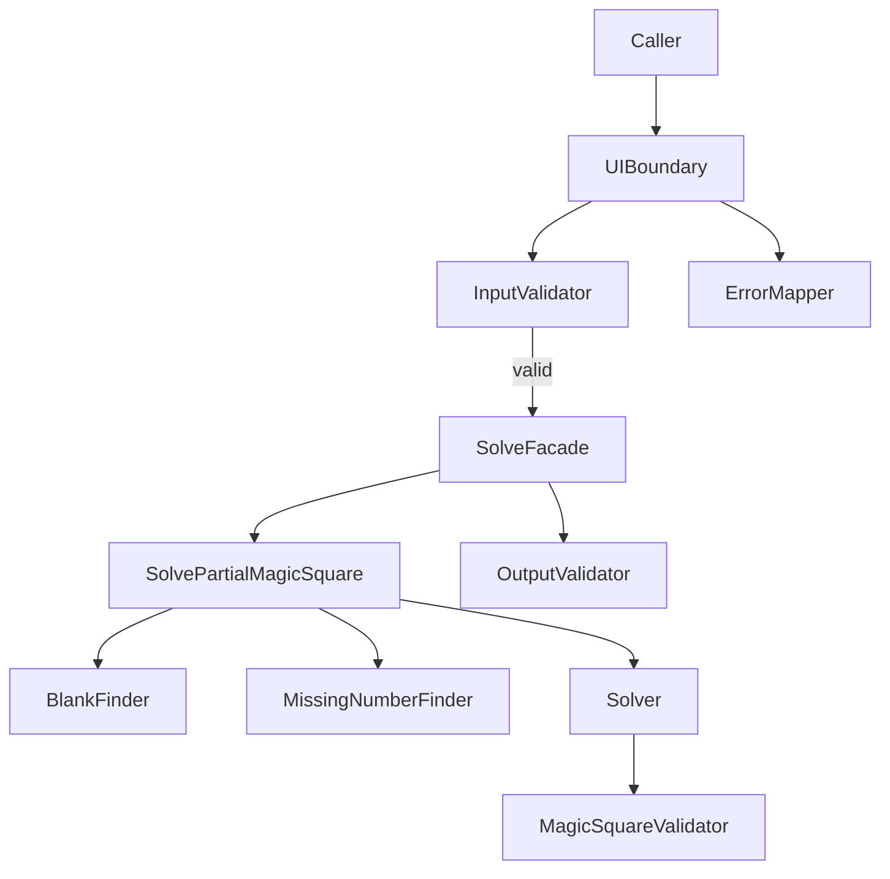

# PRD — Magic Square 4×4 TDD Practice

| 항목 | 내용 |
|---|---|
| **Document ID** | PRD-MSQ-4X4-001 |
| **Version** | 0.1 (Draft) |
| **Status** | Pre-Implementation |
| **SSOT (Contract)** | Report/2 → `docs/04-dual-track-clean-architecture-design.md` |
| **SSOT (Requirements / Verification)** | Report/4 → Epic, Journey, US-01~05, Gherkin Scenarios |
| **Branch Baseline** | spec (2026-05-28) |

---

## 1. Executive Summary

Magic Square 4×4 TDD Practice는 **4×4 부분 마방진(빈칸 2개)을 입력받아 Case A → Case B 순으로 배치를 시도하고, 성공 시 `int[6]`을 반환하는 순수 로직 시스템**이다. 본 PRD의 1차 목적은 알고리즘 난이도가 아니라 **불변식 기반 설계·입출력 계약 고정·Boundary/Domain 분리·Dual-Track RED-GREEN-REFACTOR·Concept-to-Code Traceability**를 구현 전에 고정하는 것이다. Track A(Boundary)는 `INPUT_*` 계약과 ErrorResponse만 검증하고 Domain Mock으로 격리하며, Track B(Domain)는 INV-G/M/S 불변식과 Solver 진리만 검증한다. 모든 요구사항은 pytest로 **Given/When/Then 또는 Test ID(D-*, U-C*)** 로 검증 가능해야 한다.

---

## 2. Background

1~16을 중복 없이 4×4에 배치할 때 **행·열·대각선 합이 동시에** 같아야 한다. 수작업으로는 “한 줄만 맞음” 상태(부분 성공 착시)가 자주 발생하고, 판정 기준이 사람마다 달라진다(Report/1 — Problem Definition).

본 프로젝트는 “마방진 퍼즐 앱”이 아니라 **TDD·Clean Architecture·ECB 훈련**이다. 올바른 순서는 구현이 아니라 **(1) 불변식 정의 → (2) 입출력 계약 → (3) 실패/反例 명세 → (4) RED 테스트 → (5) 최소 GREEN → (6) REFACTOR 후 계약 불변**이다(Report/1, Report/4 Journey Stage 1~5).

UI·DB·Web 없이 **콘솔/pytest** 로만 검증 가능한 범위로 PRD를 한정한다.

---

## 3. Problem Statement

**잘못된 문제 정의:** “4×4 마방진을 만드는 프로그램을 작성한다.”

**본 PRD의 문제 정의:**  
주어진 **부분 4×4 격자**(0=빈칸 2개, non-zero 중복 없음, 값 ∈ `{0}∪{1..16}`)에 대해, row-major 빈칸과 누락 숫자 2개를 확정하고, **Case A → Case B** 순으로 배치했을 때 **완성 격자가 마방진 불변식(INV-M1~M5)을 만족하는지** 판정한 뒤, 성공 시 **`[r1,c1,n1,r2,c2,n2]`(1-index, 길이 6)** 를, 실패 시 **정의된 ErrorResponse**를 **결정적으로** 반환하는 시스템을, 테스트 가능한 계약으로 먼저 고정한 뒤 구현한다.

입출력 계약이 핵심인 이유: Dual-Track TDD에서 Boundary RED와 Domain RED의 **assertion 경계**가 계약 없으면 정의되지 않으며, 리팩토링 후 회귀 여부도 **외부 계약 동일성**으로만 판단할 수 있기 때문이다(Report/4 Stage 2, Report/2).

---

## 4. Why Now / Why Chain

| Why | 학습자 문제 | PRD가 닫는 것 |
|---|---|---|
| **Why #1** | “거의 맞음”으로 성공 오판 | INV-M* **동시 만족**만 성공 |
| **Why #2** | 테스트 기준 불명확 | Given/When/Then + Test ID |
| **Why #3** | Boundary에 Domain 알고리즘 혼입 | Dual-Track + Mock (RG-05) |
| **Why #4** | RED 없이 `src/` 작성 | RED 확인 후 GREEN만 허용 |
| **Why #5** | REFACTOR 후 계약 붕괴 | RG-01~03, 전체 pytest GREEN |

**Why now:** 설계 산출물(Report/1~4, docs/01~04, Cursor Rules)이 확정되었고, Epic→Scenario 검증(Report/4 Level 5)에서 **구현 착수 전 계약·Story·Scenario 정렬**이 선행 조건으로 식별되었다.

---

## 5. Target Users

| Actor | 설명 | 사용 환경 |
|---|---|---|
| **TDD 학습자 (Learner)** | RED-GREEN-REFACTOR, Dual-Track 수행 | pytest, 로컬 CLI |
| **코드 리뷰어 (Reviewer)** | 계약·Traceability·커버리지 검증 | pytest, Report, PR diff |
| **ECB 훈련 개발자** | Boundary/Domain/Control 분리 학습 | `src/magicsquare/` 패키지 |

**Out of user environment:** 그래픽 UI, DB, Web/API, 인증, 외부 서비스.

---

## 6. Vision & Epic Goal

**Epic:** 불변식 기반 사고 훈련 시스템 구축 (Report/4)

| Epic Goal | 검증 방법 |
|---|---|
| 불변식(INV-G/M/S)을 설계의 출발점으로 고정 | Traceability Matrix §21 |
| 입·출력·Error 계약을 변경 없이 유지 | RG-01, RG-03, U-C02~10 |
| Dual-Track TDD로 Boundary·Domain RED 분리 | §15; U-C* vs D-* |
| Concept→Test→Component 추적 | §21 |
| Domain coverage ≥95%, Boundary input 검증 100% | §14, §16 |

---

## 7. Persona

**지훈** — TDD·Clean Architecture 학습 중인 개발자.

- 알고리즘 “정답”보다 **설계·계약·테스트·리팩토링**을 훈련 목표로 둔다.
- Boundary 테스트에서 magic sum·Case 선택 이유를 assert하지 않는다(Dual-Track).
- `34`, `16`, `4` 리터럴 산재 및 Solution6 하드코딩을 금지한다(Report/3, Cursor Rules).

---

## 8. User Journey Summary

| Stage | Pain Point | Learning Outcome |
|---|---|---|
| **1. 문제 인식** | 부분 성공 착시 | 마방진 = INV **동시** 만족 |
| **2. 계약 정의** | 경계 케이스 누락 | Input/Output/Error **8종 고정** |
| **3. 도메인 분리** | Solver에 검증·탐색 혼합 | Blank/Missing/Validator/Solver **SRP** |
| **4. Dual-Track TDD** | 트랙 혼합 | Mock Boundary / 순수 Domain |
| **5. 회귀 보호** | Happy path만 존재 | Edge·反例·message snapshot |

---

## 9. Scope

### 9.1 In-Scope

| ID | Capability |
|---|---|
| S-01 | Boundary 입력 검증 (`INPUT_*`) |
| S-02 | Boundary 성공/실패 응답 조립 및 출력 형식 검증 |
| S-03 | Domain: row-major 빈칸 좌표 2개 확정 |
| S-04 | Domain: 누락 숫자 2개 확정 (smaller < larger) |
| S-05 | Domain: 완성 격자 마방진 판정 (INV-M1~M5) |
| S-06 | Domain: Case A → Case B → `SOLVE_IMPOSSIBLE` |
| S-07 | Control: Boundary 통과 후 Domain Use Case 조율 |
| S-08 | RED-GREEN-REFACTOR 규칙 준수 가능한 테스트 구조 |

### 9.2 Out-of-Scope

| Item | Reason |
|---|---|
| UI 화면 | Non-goal (Report/1) |
| DB/Web/API 서버 | 본 PRD는 순수 로직·pytest |
| N×N 일반화 | 4×4 고정 훈련 |
| 완전 생성 알고리즘(임의 valid grid 생성) | Solve 계약만 P0; Generate(AC-G*)는 **Decision Needed §22** |
| 사용자 인증/권한, 네트워크, QR, 외부 연동 | 명시적 Out |
| MatrixRepository 영속화 | P2; Integration IT-*는 **Post-MVP** (Report/2) |

---

## 10. Functional Requirements

### FR-01 Input Verification (Boundary)

- **Description:** Caller가 제출한 `int[4][4]`가 Input Contract를 만족하는지 검증한다. 실패 시 Domain resolver를 호출하지 않는다.
- **Layer:** Boundary (`InputValidator`, `UIBoundary`)
- **Input:** `matrix: int[4][4] | null`
- **Processing Rules:**
  1. 검사 순서(첫 실패에서 중단): `null` → row=4 → each row col=4 → cell ∈ `{0}∪{1..16}` → `count(0)==2` → non-zero 중복 없음.
  2. 각 위반은 **정확히 하나**의 `INPUT_*` Code에 매핑한다.
- **Output:** 검증 통과 시 Domain 호출 **1회**; 실패 시 `ErrorResponse` (§13).
- **Acceptance Criteria:**
  - AC-FR01-01: `matrix is null` → `INPUT_NULL`, Domain **0회** 호출.
  - AC-FR01-02: rows≠4 → `INPUT_ROW_COUNT`, Domain 0회.
  - AC-FR01-03: any row cols≠4 → `INPUT_COL_COUNT`, Domain 0회.
  - AC-FR01-04: any cell ∉ `{0}∪{1..16}` → `INPUT_VALUE_RANGE`, Domain 0회.
  - AC-FR01-05: `count(0)≠2` → `INPUT_EMPTY_COUNT`, Domain 0회.
  - AC-FR01-06: non-zero duplicate → `INPUT_DUPLICATE`, Domain 0회.
  - AC-FR01-07: Contract 통과 → Domain resolver **정확히 1회** 호출.
- **Error / Exception Policy:** §13 Boundary 표; `result`는 항상 `null`.
- **Related Business Rules:** BR-01~BR-05
- **Related Test Direction:** Track A — U-C02~U-C09; SC-BND-VAL-001~003
- **Component Candidate:** `InputValidator`, `UIBoundary`

---

### FR-02 Blank Coordinate Discovery (Domain)

- **Description:** row-major 순으로 첫·둘째 `0` 셀의 좌표를 1-index로 확정한다.
- **Layer:** Domain (`EmptyCellPair` / BlankFinder)
- **Input:** `PartialGrid4x4` (Pre: INV-G3)
- **Processing Rules:**
  1. 스캔 순서: `(1,1)→(1,4)→(2,1)→…→(4,4)`.
  2. 첫 `0` → `(r1,c1)`, 둘째 `0` → `(r2,c2)`.
  3. 외부 노출 좌표는 **1-index** `{1..4}`.
- **Output:** `(r1,c1,r2,c2)` 또는 `INVALID_EMPTY_COUNT` (빈칸≠2)
- **Acceptance Criteria:**
  - AC-FR02-01: 빈칸 `(2,3)`, `(3,1)` → first=(2,3), second=(3,1) (D-H04).
  - AC-FR02-02: 빈칸 `(1,1)`, `(4,4)` → first=(1,1), second=(4,4) (D-E01).
  - AC-FR02-03: `count(0)==1` → `INVALID_EMPTY_COUNT` (D-F01).
  - AC-FR02-04: `count(0)≥3` → `INVALID_EMPTY_COUNT` (D-F02).
- **Error / Exception Policy:** Domain error `INVALID_EMPTY_COUNT`; Boundary 매핑은 **Decision Needed §22** (Domain-only vs `INPUT_EMPTY_COUNT` 이중 검증).
- **Related Business Rules:** BR-02, BR-06
- **Related Test Direction:** Track B — D-H04, D-E01, D-F01, D-F02
- **Component Candidate:** `BlankFinder` / `EmptyCellPair`

---

### FR-03 Missing Number Discovery (Domain)

- **Description:** `{1..16} \ {non-zero in grid}`로 누락 2개를 계산한다. `0`은 집합에서 제외한다.
- **Layer:** Domain (`MissingPair` / MissingNumberFinder)
- **Input:** `PartialGrid4x4` (Pre: INV-G4)
- **Processing Rules:**
  1. `|missing|==2`.
  2. `smaller() = min(missing)`, `larger() = max(missing)`, `smaller() < larger()`.
- **Output:** `MissingPair(smaller, larger)`
- **Acceptance Criteria:**
  - AC-FR03-01: 14개 non-zero, 2 zeros → missing 집합 크기 2 (D-H05).
  - AC-FR03-02: `0`은 missing·present 어느 쪽에도 포함되지 않음.
  - AC-FR03-03: `smaller() < larger()` 항상 참.
  - AC-FR03-04: missing 합 = `136 − sum(non-zero)` (`136 = 1+…+16`).
- **Error / Exception Policy:** INV-G4 위반 시 VO 생성 `INVALID_DUPLICATE` (D-F03).
- **Related Business Rules:** BR-07, BR-08
- **Related Test Direction:** Track B — D-H05, D-F03
- **Component Candidate:** `MissingNumberFinder` / `MissingPair`

---

### FR-04 Magic Square Validation (Domain)

- **Description:** 빈칸 없는 4×4 격자가 INV-M1~M5를 **모두** 만족하면 `true`, 하나라도 위반하면 `false`.
- **Layer:** Domain (`MagicSquareValidator`)
- **Input:** `CompletedGrid4x4` (each cell ∈ `{1..16}`)
- **Processing Rules:** BR-09~BR-12; magic sum = **34** (`MAGIC_CONSTANT`).
- **Output:** `boolean`
- **Acceptance Criteria:**
  - AC-FR04-01: Example Grid A(완성) → `true` (AC-V01 / D-H01 전제).
  - AC-FR04-02: 한 행 합 ≠34 → `false` (D-E04).
  - AC-FR04-03: 행·열 합=34, 주대각 ≠34 → `false` (D-E03 / AC-V07).
  - AC-FR04-04: INV-M1~M5 전부 충족 ↔ `true` (논리 AND).
- **Error / Exception Policy:** `false` 반환; 예외 아님.
- **Related Business Rules:** BR-09~BR-12
- **Related Test Direction:** Track B — D-E03, D-E04, D-H01
- **Component Candidate:** `MagicSquareValidator`

---

### FR-05 Two-Combination Solver and Result Formatting (Domain + Boundary)

- **Description:** Case A(smaller→first blank, larger→second) 시도 후 Validator; 실패 시 Case B 반대; 둘 다 실패 시 `SOLVE_IMPOSSIBLE`. 성공 시 `int[6]` 반환.
- **Layer:** Domain (`CompletionStrategy`, `SolvePartialMagicSquare`); Boundary (`OutputValidator`, `UIBoundary`)
- **Input:** Contract-valid `int[4][4]` (Boundary 통과 후)
- **Processing Rules:**
  1. **Attempt 1 (Case A):** `(r1,c1)←smaller`, `(r2,c2)←larger` → if `isValid` then success.
  2. **Attempt 2 (Case B):** Case A invalid only → `(r1,c1)←larger`, `(r2,c2)←smaller` → if `isValid` then success.
  3. Case A success 시 Case B **시도하지 않음** (INV-S3).
  4. Both fail → `SOLVE_IMPOSSIBLE` (§13).
  5. 성공 시 `[r1,c1,n1,r2,c2,n2]`; 좌표=FR-02, `{n1,n2}`=FR-03 missing set.
- **Output:**
  - Success: `SuccessResponse { status:"OK", result: int[6] }` — `message` 필드 **없음**.
  - Failure: `ErrorResponse { status:"ERROR", code, message, result:null }`
- **Acceptance Criteria:**
  - AC-FR05-01: Case A only valid → `[r1,c1,smaller,r2,c2,larger]` (D-H02).
  - AC-FR05-02: Case A invalid, B valid → `[r1,c1,larger,r2,c2,smaller]` (D-H03 / SC-DOM-SOL-001).
  - AC-FR05-03: Both invalid → `SOLVE_IMPOSSIBLE` (D-F04).
  - AC-FR05-04: `len(result)==6`; `r*,c* ∈ {1..4}`.
  - AC-FR05-05: 동일 입력 → 동일 `result` 또는 동일 Error (결정성).
  - AC-FR05-06: 특정 Solution6 상수 하드코딩으로만 통과하는 구현 **금지** (서로 다른 valid 입력에서 result가 입력에 따라 달라질 수 있음).
- **Error / Exception Policy:** `SOLVE_IMPOSSIBLE` — §13; Boundary가 Domain failure를 ErrorResponse로 매핑.
- **Related Business Rules:** BR-06~BR-14
- **Related Test Direction:** Track B — D-H02, D-H03, D-F04, D-H01; Track A — U-C01, U-C10
- **Component Candidate:** `Solver` / `CompletionStrategy`, `ResultFormatter` / `OutputValidator`

---

## 11. Business Rules / Domain Rules

| ID | Rule (항상 참) | Invariant |
|---|---|---|
| **BR-01** | 입력 격자는 **4행×4열**이다. | INV-G1 |
| **BR-02** | `0`(빈칸)은 **정확히 2개**이다. | INV-G3 |
| **BR-03** | 각 셀 ∈ `{0}∪{1..16}`이다. | INV-G2 |
| **BR-04** | non-zero 값은 **중복되지 않는다**. | INV-G4 |
| **BR-05** | Boundary는 BR-01~BR-04 위반 시 Domain resolver를 **호출하지 않는다**. | INV-A2 |
| **BR-06** | 첫 빈칸 = row-major **첫** `0`; 둘째 빈칸 = row-major **둘째** `0`. | INV-S1 |
| **BR-07** | 누락 숫자 = `{1..16} \ {non-zero}`; **정확히 2개**. | INV-S2 |
| **BR-08** | `smaller < larger` (오름차순 접근). | INV-S2 |
| **BR-09** | 완성 격자는 `{1..16}` **순열**이다. | INV-M1 |
| **BR-10** | 4행 각각 합 = **34**. | INV-M2 |
| **BR-11** | 4열 각각 합 = **34**. | INV-M3 |
| **BR-12** | 주대각·부대각 합 각각 = **34**. | INV-M4, M5 |
| **BR-13** | Case A 성공 시 smaller→first, larger→second; **A 우선**. | INV-S3 |
| **BR-14** | 성공 출력 = `int[6]`; 좌표 **1-index** `{1..4}`. | Output Contract |
| **BR-15** | `MAGIC_CONSTANT=34`는 named constant; 리터럴 산재 **금지**. | Report/3 |
| **BR-16** | Caller 제출 `matrix`는 submit 처리 중 **in-place 변경되지 않는다**. | NFR §14 |

---

## 12. Input / Output Contract

### 12.1 Input Contract

| Field / Item | Type | Rule | Valid Example | Invalid Example | Error Code |
|---|---|---|---|---|---|
| `matrix` | `int[4][4]` | non-null | 4×4 with 2 zeros | `null` | `INPUT_NULL` |
| rows | int | ==4 | 4 rows | 3 rows | `INPUT_ROW_COUNT` |
| cols per row | int | ==4 each | all len 4 | one row len 3 | `INPUT_COL_COUNT` |
| cell | int | 0 or 1~16 | `0`, `7`, `16` | `-1`, `17` | `INPUT_VALUE_RANGE` |
| empty count | — | `count(0)==2` | two zeros | one zero | `INPUT_EMPTY_COUNT` |
| duplicate | — | non-zero unique | all distinct | two `5`s | `INPUT_DUPLICATE` |

### 12.2 Output Contract (Success)

| Field / Item | Type | Rule | Valid Example | Invalid Example | Failure Policy |
|---|---|---|---|---|---|
| `status` | string | `"OK"` | `"OK"` | `"ERROR"` | OutputValidator reject |
| `result` | `int[6]` | `[r1,c1,n1,r2,c2,n2]` | `[3,3,6,4,4,1]` | length 5 | OutputValidator reject |
| `r1,c1,r2,c2` | int | 1..4; = row-major blanks | 3,3,4,4 | 0-index 2,2 | OutputValidator reject |
| `n1,n2` | int | 1..16; = missing set; distinct | 6,1 | duplicate n | OutputValidator reject |
| Case order | — | A or B per INV-S3 | B: n1=6,n2=1 | swapped when A valid | RG-02 violation |

### 12.3 Output Contract (Error)

| Field | Type | Rule |
|---|---|---|
| `status` | string | `"ERROR"` |
| `code` | string | §13 enum |
| `message` | string | §13 **완전 일치** |
| `result` | null | always `null` |

---

## 13. Error / Failure Policy

| Condition | Error Code | Message (exact) | Layer | Domain Call | Related AC |
|---|---|---|---|---|---|
| `matrix is null` | `INPUT_NULL` | `Input matrix must not be null.` | Boundary | **No** | AC-FR01-01, U-C02 |
| rows ≠ 4 | `INPUT_ROW_COUNT` | `Matrix must have exactly 4 rows.` | Boundary | **No** | AC-FR01-02, U-C03 |
| any row cols ≠ 4 | `INPUT_COL_COUNT` | `Each row must have exactly 4 columns.` | Boundary | **No** | AC-FR01-03, U-C04 |
| cell ∉ {0}∪{1..16} | `INPUT_VALUE_RANGE` | `Each cell must be 0 or an integer from 1 to 16.` | Boundary | **No** | AC-FR01-04, U-C07/08 |
| count(0) ≠ 2 | `INPUT_EMPTY_COUNT` | `Matrix must contain exactly 2 empty cells (0).` | Boundary | **No** | AC-FR01-05, U-C05/06 |
| non-zero duplicate | `INPUT_DUPLICATE` | `Non-zero values must not be duplicated.` | Boundary | **No** | AC-FR01-06, U-C09 |
| Case A & B both invalid | `SOLVE_IMPOSSIBLE` | `No valid magic square completion exists for the given grid.` | Domain→Boundary | **Yes** (returns error) | AC-FR05-03, D-F04, U-C10 |
| Unhandled exception | `INTERNAL_ERROR` | `An unexpected error occurred.` | Boundary/Control | varies | U-C11 |

**SOLVE_IMPOSSIBLE 정책 (확정):** Domain `CompletionStrategy`는 `SOLVE_IMPOSSIBLE` Domain failure를 반환하고, Boundary `ErrorMapper`는 이를 **ErrorResponse**(`status=ERROR`, `result=null`, 위 message)로 매핑한다. **예외를 Caller까지 전파하지 않는다** (pytest는 response assert).

**입력 검증 실패:** Domain resolver(`SolvePartialMagicSquare.execute`) **호출 횟수 = 0** (AC-FR01-01~06).

---

## 14. Non-Functional Requirements

| ID | Requirement | Verification |
|---|---|---|
| **NFR-01** | Domain Logic branch coverage **≥ 95%** | pytest-cov, `docs/04` §4.4 |
| **NFR-02** | Boundary (Input/Output/Error) branch coverage **≥ 85%** | pytest-cov |
| **NFR-03** | **Deterministic:** 동일 `matrix` → 동일 `SuccessResponse` 또는 동일 `ErrorResponse` | AC-FR05-05; repeated submit test |
| **NFR-04** | **No side effects:** submit 후 caller `matrix` 원소 값 **변경 없음** | BR-16; before/after assert |
| **NFR-05** | **Performance:** 단일 solve (Boundary+Domain) **≤ 50ms** on dev machine (4×4) | optional perf test / manual benchmark |
| **NFR-06** | Boundary·Domain **책임 분리**; Entity → Boundary import **0건** | static check / review |
| **NFR-07** | Solution6·Example Grid **하드코딩 금지** | AC-FR05-06; code review |
| **NFR-08** | `GRID_SIZE`, `MAX_VALUE`, `MAGIC_CONSTANT` **named constants** in `entity/constants.py` | grep / review |
| **NFR-09** | `print()` debugging **금지** | Cursor Rules §06 |
| **NFR-10** | 테스트 assertion **약화·삭제 금지** (사용자 명시 요청 없음) | RG-04 |

---

## 15. Dual-Track TDD Strategy

### 15.1 Track A — Boundary / UI Contract TDD

| Focus | Test Type | Mock |
|---|---|---|
| Input §12.1 | U-C02~U-C09 | Domain **Mock** |
| Output format | U-C01 | Domain returns fixed `int[6]` |
| `SOLVE_IMPOSSIBLE` mapping | U-C10 | Domain Mock raises/returns failure |
| Domain **0-call** on input fail | U-C02~09 + call_count | Mock |

**GREEN:** InputValidator / ErrorMapper / OutputValidator **최소** 구현만.

### 15.2 Track B — Domain / Logic TDD

| Focus | Test ID |
|---|---|
| Blank | D-H04, D-E01, D-F01, D-F02 |
| Missing | D-H05, D-F03 |
| Validate | D-E03, D-E04 |
| Case A success | D-H02 |
| Case A fail → B success | D-H03, SC-DOM-SOL-001 |
| Both fail | D-F04 |
| E2E Solve | D-H01 |

**RED order (fixed):** `D-F05 → D-F03 → D-F06 → D-F01 → D-H04 → D-H05 → D-E03 → D-E04 → D-H02 → D-H03 → D-F04 → D-H01` (Report/2, rules/01).

### 15.3 Parallel Progression Rules

1. Track A·B 테스트 **혼합 금지** (한 test file = 한 track).
2. RED 확인 **후**만 `src/` production 코드 추가.
3. GREEN = **현재 RED 1건** 통과 최소 코드; REFACTOR = 전체 GREEN 유지하며 구조 개선 **만**.
4. “Domain 전부 완성 후 Boundary” **금지** — Boundary INPUT RED는 Domain Mock으로 **병렬** 가능.
5. 테스트 약화·무근거 skip **금지**.

---

## 16. Test Plan / QA

### 16.1 Normal Scenarios

| ID | Scenario | Expected |
|---|---|---|
| TP-N01 | Case A only valid | `int[6]` with smaller at first blank (D-H02) |
| TP-N02 | Case A invalid, B valid | e.g. `[3,3,6,4,4,1]` (SC-DOM-SOL-001 / D-H03) |

### 16.2 Exception Scenarios

| ID | Scenario | Expected Code | Domain Call |
|---|---|---|---|
| TP-E01 | 3×4 matrix | `INPUT_ROW_COUNT` | 0 |
| TP-E02 | 4×3 matrix | `INPUT_COL_COUNT` | 0 |
| TP-E03 | one zero | `INPUT_EMPTY_COUNT` | 0 |
| TP-E04 | three zeros | `INPUT_EMPTY_COUNT` | 0 |
| TP-E05 | cell `17` | `INPUT_VALUE_RANGE` | 0 |
| TP-E06 | cell `-1` | `INPUT_VALUE_RANGE` | 0 |
| TP-E07 | duplicate non-zero | `INPUT_DUPLICATE` | 0 |
| TP-E08 | both combinations invalid | `SOLVE_IMPOSSIBLE` | ≥1 |

### 16.3 Boundary Scenarios

| ID | Check |
|---|---|
| TP-B01 | Value `1` and `16` valid in cells |
| TP-B02 | `0` only as blank (excluded from missing) |
| TP-B03 | Output coords 1-index only |
| TP-B04 | `len(result)==6` |

### 16.4 Representative Test Data

**TP-N02 — reverse success matrix (SC-DOM-SOL-001):**

| | c1 | c2 | c3 | c4 |
|---|---|---|---|---|
| r1 | 16 | 2 | 3 | 13 |
| r2 | 5 | 11 | 10 | 8 |
| r3 | 9 | 7 | **0** | 12 |
| r4 | 4 | 14 | 15 | **0** |

- Missing: `{1, 6}`; blanks (3,3), (4,4); Case A fail; Case B success → **`[3, 3, 6, 4, 4, 1]`**

**TP-E03 — one blank:**

```
[[16,3,2,13],[5,10,11,8],[9,6,7,12],[4,15,14,0]]
```

**TP-E07 — duplicate:**

```
[[16,3,2,13],[5,5,11,8],[9,6,0,12],[4,15,14,0]]
```

**TP-E05 — invalid range:**

```
[[16,3,2,13],[5,10,11,8],[9,6,0,12],[4,15,17,0]]
```

**TP-N01 — Case A success:** **Decision Needed §22** — dedicated matrix to be fixed in Scenario SC-DOM-SOL-002 (D-H02) before implementation RED.

---

## 17. Architecture Overview (High-Level)



| Layer | Responsibility | Must NOT |
|---|---|---|
| **Boundary** | Input/Output/Error contract | Domain algorithm, magic sum assert in tests |
| **Control** | Orchestrate Boundary↔Domain | Business rules |
| **Domain** | INV-G/M/S, Case A/B | I/O, Boundary, DB, UI |

**Dependency:** Boundary → Control → Domain; Domain **must not** import Boundary/Control/Data.

---

## 18. Component Candidates

| Component | Layer | Responsibility | Input | Output | FR | Test |
|---|---|---|---|---|---|---|
| **BoundaryValidator** / `InputValidator` | Boundary | BR-01~05 | `int[4][4]` | pass / `INPUT_*` | FR-01 | U-C02~09 |
| **BlankFinder** / `EmptyCellPair` | Domain | BR-06 | `PartialGrid4x4` | coords 1-index | FR-02 | D-H04, D-E01 |
| **MissingNumberFinder** / `MissingPair` | Domain | BR-07~08 | `PartialGrid4x4` | smaller, larger | FR-03 | D-H05 |
| **MagicSquareValidator** | Domain | BR-09~12 | `CompletedGrid4x4` | boolean | FR-04 | D-E03, D-E04 |
| **Solver** / `CompletionStrategy` | Domain | BR-13, Case A/B | grid+blanks+missing | `Solution6` / fail | FR-05 | D-H02,H03,F04 |
| **ResultFormatter** / `OutputValidator` | Boundary | BR-14 | `int[6]` | pass / reject | FR-05 | U-C01 |
| **`UIBoundary`** | Boundary | submit orchestration | matrix | Response | FR-01,05 | U-C*, IT-* |
| **`SolveFacade`** | Control | use case wiring | valid matrix | to Domain | FR-05 | IT-OK01 |
| **`ErrorMapper`** | Boundary | code→message | Domain/Input fail | ErrorResponse | FR-01,05 | RG-03 |

---

## 19. Risks & Ambiguities

| Risk | Impact | Mitigation / Decision |
|---|---|---|
| 1-index vs 0-index 혼동 | Wrong AC | BR-14; external API **1-index only**; internal 0-index **비노출** |
| row-major 정의 누락 | Wrong blank order | BR-06; D-H04; doc+test+comment **三处一致** (Report/2 checklist) |
| small-first vs reverse 데이터 혼동 | False GREEN | TP-N01/N02 분리; SC-DOM-SOL-001 고정 |
| 입력 matrix in-place 변경 | Caller corruption | BR-16; NFR-04 |
| SOLVE_IMPOSSIBLE 미정 | Block implementation | **§13 확정** — ErrorResponse |
| `34` 하드코딩 | Regression | BR-15; `MAGIC_CONSTANT` |
| Boundary·Domain 혼합 | RG-05 violation | Dual-Track §15; Domain Mock |
| Scenario coverage ~40% | Missed RED | Report/4 Level 5 backlog → §16 확장 before full MVP |
| Validate-only API 노출 여부 | Scope creep | **Decision Needed §22** |

---

## 20. Engineering Principles

| Principle | Source | PRD Enforcement |
|---|---|---|
| PEP8, line length 88 | rules/02 | NFR review |
| Type hints all public functions | rules/02, 08 | code review |
| Google docstring public methods | rules/02 | code review |
| pytest + AAA | rules/05 | all tests |
| ECB layer separation | rules/03 | §17, NFR-06 |
| RED → GREEN → REFACTOR | rules/04 | §15.3 |
| No `print()` debug | rules/06 | NFR-09 |
| No bare `except:` | rules/06 | code review |
| No assertion weakening | rules/04, 06 | NFR-10 |
| No magic number literals for domain | rules/06 | NFR-08 |
| No RED-less `src/` change | rules/04 | §15.3 |
| SSOT: `.cursor/rules/*.mdc` over `.cursorrules` | Report/3 | Appendix B |

---

## 21. Traceability Matrix

| Concept / Invariant | Business Rule | Feature | Acceptance Criteria | Test Candidate | Component |
|---|---|---|---|---|---|
| 4×4 입력 | BR-01 | FR-01 | AC-FR01-02,03 | U-C03, U-C04, D-F06 | InputValidator |
| 빈칸 2개 | BR-02 | FR-01, FR-02 | AC-FR01-05, AC-FR02-03,04 | U-C05, U-C06, D-F01, D-F02 | InputValidator, BlankFinder |
| 값 0 또는 1~16 | BR-03 | FR-01 | AC-FR01-04 | U-C07, U-C08, D-F05 | InputValidator |
| 중복 금지 | BR-04 | FR-01, FR-03 | AC-FR01-06, AC-FR03 | U-C09, D-F03 | InputValidator |
| Domain 미호출(입력 fail) | BR-05 | FR-01 | AC-FR01-01~06 | U-C02~09 call_count | UIBoundary |
| row-major 첫 빈칸 | BR-06 | FR-02, FR-05 | AC-FR02-01,02 | D-H04, D-E01 | BlankFinder |
| 누락 2개 | BR-07 | FR-03 | AC-FR03-01 | D-H05 | MissingNumberFinder |
| 누락 오름차순 | BR-08 | FR-03, FR-05 | AC-FR03-03 | D-H05, D-E02 | MissingNumberFinder |
| 순열 1~16 | BR-09 | FR-04 | AC-FR04-04 | D-H01 | MagicSquareValidator |
| 행 합 34 | BR-10 | FR-04 | AC-FR04-02 | D-E04 | MagicSquareValidator |
| 열 합 34 | BR-11 | FR-04 | AC-FR04-04 | D-H03 | MagicSquareValidator |
| 대각 합 34 | BR-12 | FR-04 | AC-FR04-03 | D-E03 | MagicSquareValidator |
| 상수 34 named | BR-15 | FR-04,05 | NFR-08 | review | constants.py |
| small-first (Case A) | BR-13 | FR-05 | AC-FR05-01 | D-H02, TP-N01 | Solver |
| reverse (Case B) | BR-13 | FR-05 | AC-FR05-02 | D-H03, TP-N02 | Solver |
| both fail | BR-13 | FR-05 | AC-FR05-03 | D-F04, TP-E08 | Solver |
| int[6] 반환 | BR-14 | FR-05 | AC-FR05-04 | U-C01 | OutputValidator |
| 1-index 좌표 | BR-14 | FR-02,05 | AC-FR05-04 | D-H04, SC-DOM-SOL-001 | BlankFinder, Solver |
| Error 8종 message | §13 | FR-01,05 | AC-FR01-*, AC-FR05-03 | U-C02~10, RG-03 | ErrorMapper |
| 결정성 | NFR-03 | FR-05 | AC-FR05-05 | repeat submit | UIBoundary |
| matrix 불변 | BR-16 | — | NFR-04 | before/after | UIBoundary |

---

## 22. Open Questions / Decision Needed

| ID | Topic | Conflict | Options | PRD Impact |
|---|---|---|---|---|
| **DN-01** | Standalone **Validate** API (완성 격자 `valid: true/false`) | Report/1 Primary=검증 vs PRD FR Solve 중심 | (A) P0 public API (B) Domain internal only | §9, FR-04 exposure |
| **DN-02** | **Generate** (AC-G01~G04) | docs/03 vs §9.2 Out | (A) Post-MVP P2 (B) Remove from roadmap | §9, §12 |
| **DN-03** | **TP-N01** Case A-only matrix | Scenario SC-DOM-SOL-002 미작성 | Fix matrix in Report/4 before RED | §16.4 |
| **DN-04** | Domain `INVALID_*` vs Boundary `INPUT_*` for same rule | 이중 검증(빈칸 2) | (A) Boundary only (B) Domain VO also | FR-02 Error policy |
| **DN-05** | Report/1~4 **파일 미저장** vs PRD references | Repo has Report/00, 01 only | Save Report 1~4 before PRD v1.0 sign-off | Document Control |
| **DN-06** | **MatrixRepository** / IT-* | Report/2 P2 | Include in MVP or defer | §9.2, §12 |

**본 PRD 본문은 DN-01~02 미확정 항목을 P0 Solve + Boundary 계약으로 **한정**하였으며, 확정 전까지 Generate/standalone Validate를 P0로 **승격하지 않는다.**

---

## 23. Appendix

### 23.1 Reference Documents

| Doc | Role |
|---|---|
| Report/1.ProblemDefinition_Report.md | Background, Why (assumed; proxy: `docs/01`, `docs/02`) |
| Report/2.CleanArchitecture_DualTrack_TDD_Design_Report.md | Contract SSOT (proxy: `docs/04`) |
| Report/3.DevelopmentEnvironment_CursorRules_ECB_UserEntity_Report.md | Quality (proxy: `Report/00`, `.cursor/rules/`) |
| Report/4.UserJourney_Epic_to_TechnicalScenario_Report.md | Req/Verification (proxy: `Report/01`, `Prompt/01`) |
| `docs/01`~`04` | SSOT originals |
| `.cursor/rules/01`~`08.mdc` | Engineering rules |
| `.cursorrules` | Legacy YAML snapshot |

### 23.2 Cursor Rules Summary

| File | Key |
|---|---|
| 01 | I/O contract, RED order |
| 02 | Python 3.10+, types, docstrings |
| 03 | ECB, Dual-Track |
| 04 | RED/GREEN/REFACTOR |
| 05 | pytest, AAA, Test ID paths |
| 06 | Forbidden patterns (6) |
| 07 | File tree |
| 08 | AI coding gates |

### 23.3 Gherkin Scenario Summary (Report/4 Level 4)

| ID | Layer | Then (key) |
|---|---|---|
| SC-DOM-SOL-001 | Domain | Case A fail → B ok; `[3,3,6,4,4,1]` |
| SC-BND-VAL-001 | Boundary | 1 blank → `INPUT_EMPTY_COUNT`; Domain 0-call |
| SC-BND-VAL-002 | Boundary | dup → `INPUT_DUPLICATE` |
| SC-BND-VAL-003 | Boundary | 17 → `INPUT_VALUE_RANGE` |

**Backlog (Level 5):** SC-DOM-BLK-001, SC-DOM-MIS-001, SC-DOM-SOL-002/003, SC-BND-VAL-004~008, SC-DOM-VAL-001.

### 23.4 RED Test ID Candidates

| Track | IDs |
|---|---|
| A | U-C01~U-C12, RED-BND-VAL-001~003 |
| B | D-F05,F03,F06,F01,F02,H04,H05,E03,E04,H02,H03,F04,H01, RED-DOM-SOL-001 |
| Integration (Post-MVP) | IT-OK01, IT-F01, IT-F02 |

### 23.5 Definition of Done (Feature)

1. Related Test IDs **pytest GREEN**
2. §12~§13 contract·message **exact match**
3. ECB dependency **no violation**
4. Boundary tests use **Domain Mock** only (RG-05)
5. Traceability row in §21 **complete** for shipped FR

---

**End of PRD v0.1**
