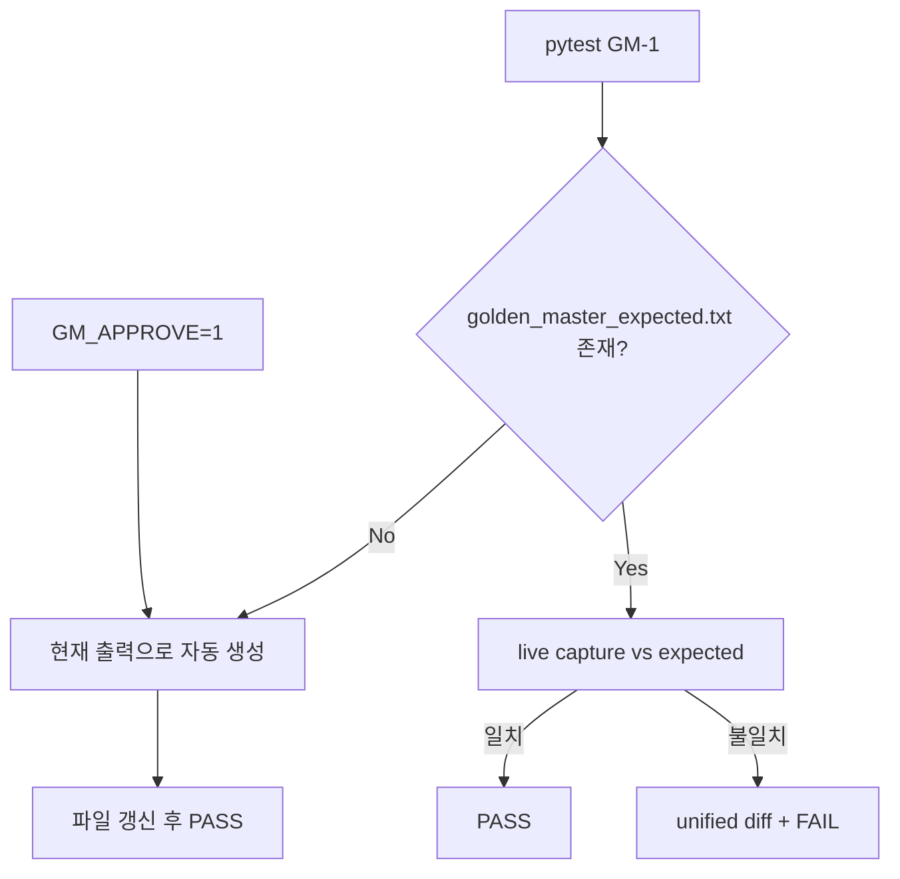

# Golden Master (GM-1) — Magic Square Solver

> **Test ID:** GM-1  
> **대상:** `SolveFacade` + `DomainPartialMagicSquareSolver` (Boundary DTO 직렬화)  
> **기준 파일:** `tests/golden_master_expected.txt` (버전 관리 필수)

---

## 1. 목적

Solver의 **관찰 가능한 출력**(Success `result` / Error `code`+`message`)이 의도치 않게 바뀌면  
pytest가 unified diff와 함께 FAIL 한다. Approval Tests / Golden Master 회귀 패턴.

---

## 2. 시나리오 (5건)

| 섹션 | 의미 | 입력 요약 | 기대 결과 |
|------|------|-----------|-----------|
| `normal_success` | Case A 성공 | blanks (1,3),(2,2) | `SuccessResponse.result` |
| `reverse_success` | Case B 성공 | blanks (3,3),(4,4) | `SuccessResponse.result` |
| `invalid_blank_count` | 빈칸 수 위반 | 0 blanks (G0) | `INPUT_EMPTY_COUNT` |
| `duplicate_number` | non-zero 중복 | duplicate 5 | `INPUT_DUPLICATE` |
| `no_valid_solution` | Domain 해 없음 | G3 격자 | `SOLVE_IMPOSSIBLE` |

에러 코드는 SSOT `ErrorCode` enum 값을 사용한다 (`INVALID_BLANK_COUNT` 등 레거시 명칭 사용 안 함).

---

## 3. 기준 파일 구조

```text
[normal_success]
Input:
16 3 0 13
...
Output:
[1, 3, 2, 2, 2, 10]

[reverse_success]
...
```

- **Input:** 공백 구분 4행 (stdout 친화)
- **Output:** `SuccessResponse.result` 의 `str(list)` (Python repr)
- **Error / Message:** `ErrorResponse.code.value` 및 SSOT `ERROR_MESSAGES` 문자열

---

## 4. Approve 패턴



| 모드 | 명령 | 동작 |
|------|------|------|
| **검증** (기본) | `pytest tests/golden_master/` | expected vs actual 비교 |
| **승인/갱신** | `GM_APPROVE=1 pytest tests/golden_master/` | 기준 파일 덮어쓰기 |
| **생성 스크립트** | `python scripts/generate_golden_master.py` | CI/로컬에서 baseline 재생성 |

불일치 시 `AssertionError` 본문에 unified diff가 포함된다.

---

## 5. 구현 구성

| 파일 | 역할 |
|------|------|
| `tests/golden_master_expected.txt` | Golden Master baseline (git tracked) |
| `tests/golden_master/harness.py` | 시나리오·캡처·파싱·diff |
| `tests/golden_master/test_gm_solver.py` | pytest GM-1 (전체 + 섹션별) |
| `scripts/generate_golden_master.py` | baseline 생성 CLI |

캡처 방식: **Result DTO 직렬화** (`SuccessResponse` / `ErrorResponse` → 텍스트).  
stdout 캡처는 CLI/GUI 레이어 추가 시 확장 가능.

---

## 6. 운영 규칙

1. **의도적 출력 변경** → `GM_APPROVE=1` 또는 generate 스크립트 실행 후 diff 리뷰 → `git add tests/golden_master_expected.txt`
2. **테스트 약화 금지** — baseline만 갱신, assert 제거 금지 (TDD RG-01)
3. **FR-02 이전** — Domain 알고리즘 변경 시 `normal_success` / `reverse_success` 섹션 반드시 재검토

---

## 7. 회귀 실행

```powershell
python -m pytest tests/golden_master/ -o addopts="" -v
python scripts/generate_golden_master.py
$env:GM_APPROVE="1"; python -m pytest tests/golden_master/ -o addopts=""
```

---

**End of GM-1 Design**
